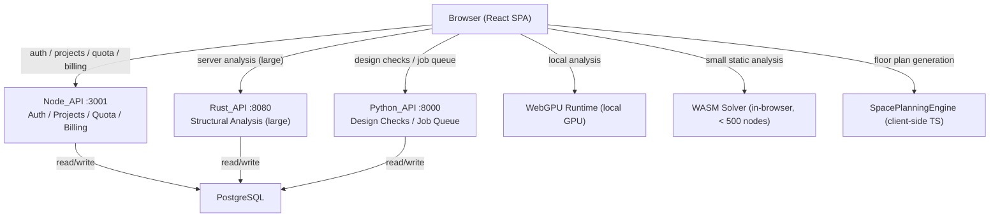
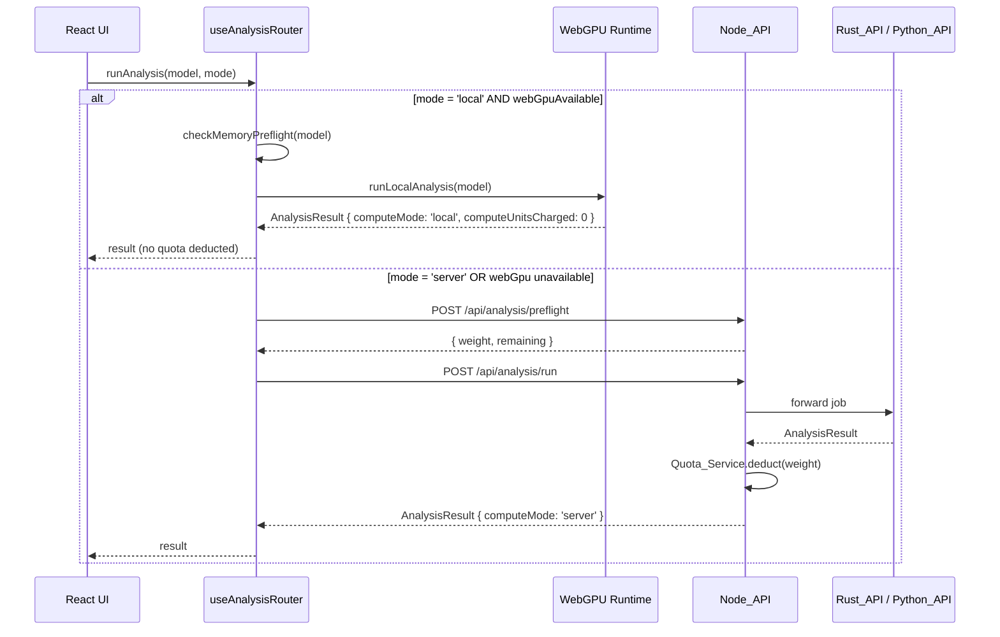
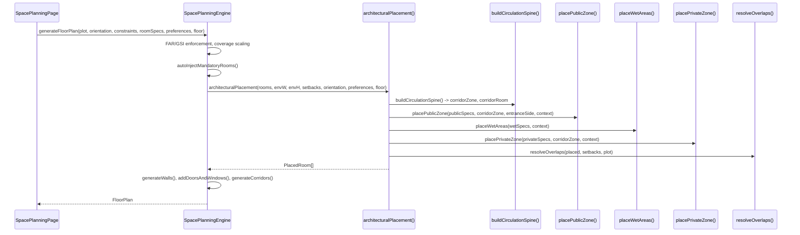

# Design Document: BeamLab Platform Refinement

## Overview

This document describes the verification, polish, and gap-closure design for the BeamLab
Ultimate platform. All major features have been implemented across prior specs. This spec
focuses on three things:

1. **Verification** — confirming that implemented features are correctly wired end-to-end,
   with particular emphasis on the house plan generator's architectural placement pipeline
   (user-reported inaccuracy) and the WebGPU analysis routing.
2. **Polish** — defining the UI/UX target state for each major page: consistent design tokens,
   loading/error/empty states, smooth transitions, and responsive breakpoints.
3. **Gap closure** — identifying and fixing the remaining gaps between spec and implementation,
   including report data accuracy, tier gating completeness, and backend validation coverage.

The platform consists of:
- `apps/web` — React SPA (Vite, TypeScript)
- `apps/api` — Node_API (Express 5, port 3001)
- `apps/rust-api` — Rust_API (Axum, port 8080)
- `apps/backend-python` — Python_API (FastAPI, port 8000)
- `apps/web/src/services/space-planning/SpacePlanningEngine.ts` — client-side floor plan engine
- `apps/web/src/hooks/useAnalysisRouter.ts` — WebGPU detection and analysis routing

---

## Architecture



### Analysis Routing Flow



### House Plan Generation Flow



---

## Components and Interfaces

### 1. House Plan Generator — Verification and Bug Investigation

The `architecturalPlacement` pipeline is implemented in
`apps/web/src/services/space-planning/SpacePlanningEngine.ts`. The user reports the plan
generator is still inaccurate despite the pipeline being implemented. The verification
approach is:

#### Step 1: Confirm `architecturalPlacement` is called

In `generateFloorPlan()`, the call site is:
```typescript
const placedRooms = roomsWithMandatory.length >= 2
  ? this.architecturalPlacement(...)
  : this.placeRooms(...);
```
The condition `>= 2` means single-room plans still use the legacy `placeRooms()`. For any
plan with 2+ rooms, `architecturalPlacement` should be called. Verify by running the tests
in `apps/web/src/services/space-planning/__tests__/architecturalPlacement.fixcheck.test.ts`.

#### Step 2: Confirm `buildCirculationSpine` places corridor first

The corridor must be placed before any habitable room. In `architecturalPlacement()`:
```typescript
const { corridorZone, corridorRoom } = this.buildCirculationSpine(
  ox, oy, envW, envH, entranceSide, preferences, floor
);
placed = [corridorRoom];
```
The corridor room is the first element in `placed`. Verify that `corridorRoom.width >= 1.0`
and that subsequent rooms are placed relative to `corridorZone`.

#### Step 3: Confirm NBC dimensions are enforced before placement

`enforceNBCMinDimensions()` must be called inside `placePublicZone`, `placeWetAreas`, and
`placePrivateZone` before computing room coordinates. The `NBC_MIN_DIMS` constant must have
the correct values:

| Room Type | Min Width (m) | Min Height (m) |
|-----------|--------------|----------------|
| living | 3.0 | 3.0 |
| master_bedroom | 3.0 | 3.0 |
| bedroom | 2.7 | 2.7 |
| kitchen | 2.1 | 1.8 |
| bathroom | 1.2 | 0.9 |
| toilet | 1.0 | 0.9 |
| corridor | 1.0 | 1.0 |
| foyer | 1.5 | 1.5 |

#### Step 4: Confirm entrance sequence validation

`validateEntranceSequence()` must be called after placement and must return `true` for any
plan with living rooms and bedrooms. The check is:
```
∀ bedroom: distanceFromEntrance(bedroom) > distanceFromEntrance(living)
```
For a south-facing plot, `distanceFromEntrance(room) = room.y`. Bedrooms must have higher
`y` values than the living room.

#### Step 5: Confirm wet area grouping

`placeWetAreas()` must set `context.wetWallX` or `context.wetWallY` after placing the first
wet room, and all subsequent wet rooms must be placed touching that same wall coordinate.
Verify by checking that `sharesWall(kitchen, bathroom)` returns `true` in the test suite.

#### Bug Condition Definition

The bug condition `isBugCondition(X)` from the realistic-house-plan-generator spec is:
```
hasPublicPrivateMixing OR missingCirculationSpine OR wetAreasIsolated
OR dimensionViolation OR noEntranceSequence
```
Run `architecturalPlacement.fixcheck.test.ts` to confirm the pipeline is working. If any
test fails, the corresponding placement method needs to be debugged.

---

### 2. WebGPU Local Compute Architecture

Implemented in `apps/web/src/hooks/useAnalysisRouter.ts`.

#### Detection

On mount, `useAnalysisRouter` calls `navigator.gpu.requestAdapter()`. The result is cached
at module level so subsequent calls are synchronous. The `webGpuAvailable` boolean is exposed
on the hook return value and also stored in `SubscriptionProvider` context.

```typescript
interface UseAnalysisRouterReturn {
  webGpuAvailable: boolean;
  isDetecting: boolean;
  runAnalysis: (model: AnalysisModel, mode: 'local' | 'server') => Promise<AnalysisResult>;
  checkMemoryPreflight: (model: AnalysisModel) => Promise<{ fits: boolean; warning?: string }>;
}
```

#### Local Compute Mode

When `mode === 'local'` and `webGpuAvailable === true`:
1. `checkMemoryPreflight(model)` estimates memory footprint and compares against
   `adapter.requestAdapterInfo().memoryHeaps[0].size`.
2. If memory fits, calls `runLocalAnalysis(model)` from `apps/web/src/utils/webgpuRuntime.ts`.
3. Returns `AnalysisResult { computeMode: 'local', computeUnitsCharged: 0 }`.
4. No calls to `/api/analysis/preflight` or `/api/analysis/run`.
5. No quota deduction.

#### Server Compute Mode

When `mode === 'server'` or `webGpuAvailable === false`:
1. POST `/api/analysis/preflight` → `{ weight, remaining }`.
2. Show cost preview to user.
3. On confirm: POST `/api/analysis/run`.
4. Node_API forwards to Rust_API or Python_API.
5. Quota_Service deducts `weight` compute units.
6. Returns `AnalysisResult { computeMode: 'server' }`.

#### Fallback Chain

```
WebGPU runtime error → set status: 'error', serverFallbackAvailable: true
WASM failure → log warning, fall through to Rust_API
Rust_API unavailable → fall through to Python_API (show non-blocking toast)
Python_API timeout (> 2 min) → surface AnalysisTimeoutError with retry button
All backends unavailable → surface descriptive error with retry button
```

---

### 3. Design System and UI/UX Polish

#### Design Token System

All pages must use a single shared token set defined in the Tailwind config or a CSS
variables file. Key tokens:

| Token | Value |
|-------|-------|
| `--color-primary` | `#2563EB` (blue-600) |
| `--color-surface` | `#FFFFFF` |
| `--color-surface-muted` | `#F9FAFB` |
| `--color-border` | `#E5E7EB` |
| `--color-text` | `#111827` |
| `--color-text-muted` | `#6B7280` |
| `--radius-md` | `8px` |
| `--transition-fast` | `150ms ease` |
| `--transition-base` | `200ms ease` |

#### Loading / Error / Empty State Pattern

Every data-fetching component must follow this pattern:

```tsx
if (isLoading) return <PanelSkeleton rows={4} />;
if (error) return <PanelError message={error} onRetry={refetch} />;
if (!data || data.length === 0) return <PanelEmpty message="No items yet" action={<CreateButton />} />;
return <PanelContent data={data} />;
```

`PanelErrorBoundary` (already implemented) wraps high-risk panels for uncaught exceptions.

#### Responsive Breakpoints

| Breakpoint | Width | Layout |
|-----------|-------|--------|
| `sm` | 375px | Single column, stacked panels |
| `md` | 768px | Two-column sidebar + content |
| `lg` | 1024px | Full sidebar + content + detail panel |
| `xl` | 1280px | Full layout with optimization panels |
| `2xl` | 1920px | Maximum content width with generous padding |

#### Page-by-Page Polish Targets

**LandingPage** (`apps/web/src/pages/LandingPage.tsx`):
- Already split into lazy-loaded sections. Ensure `SectionSkeleton` renders during lazy load.

**Dashboard** (`apps/web/src/pages/Dashboard.tsx`):
- Sidebar with sections: My Projects, Space Planning, Structural Modeler, Reports, Account Settings.
- Favorites tab: filter `isFavorited === true AND deletedAt === null`.
- Trash tab: filter `deletedAt !== null`.
- Empty states for each tab.
- Persistent upgrade banner for free-tier users showing plan name and "Upgrade" CTA.
- User name, avatar, and subscription tier badge in top navigation bar.

**SpacePlanningPage**:
- Floor plan canvas, room list, and constraint report must all render without errors.
- CSP solver progress indicator during solve.
- Optimization tab: Pareto front scatter plot, convergence line chart.
- Elevations tab: dimensioned building outline with north arrow and scale bar.

**ModernModeler** (structural modeling workspace):
- All 23 STAAD.Pro parity tool IDs exposed in toolbar.
- Analysis result tools show notification if analysis not run.
- `PanelErrorBoundary` wraps `StructuralModelingCanvas`, `AnalysisDesignPanel`, `AIArchitectPanel`.

**ReportBuilderPage**:
- PDF export button present and functional.
- Report reads project name from active project store, engineer name from auth session.
- PE stamp block in all professional reports.

**DetailingDesignPage**:
- Overview tab: member table with Utilization_Ratio and color-coded pass/fail
  (green ≤ 0.85, amber 0.85–1.0, red > 1.0).
- "Auto-Design All Members" button.
- "Generate Report" button when at least one member is designed.
- "Export Drawing" button for RC members.

---

### 4. Tier Gating and Subscription

#### `TIER_CONFIG` (single source of truth)

Defined in `apps/web/src/config/clientTierConfig.ts` (frontend) and
`apps/api/src/config/tierConfig.ts` (backend). Both must be kept in sync.

```typescript
const TIER_CONFIG = {
  free: {
    maxProjects: 3, maxComputeUnitsPerDay: 5,
    collaboration: false, pdfExport: false, aiAssistant: false,
    advancedDesignCodes: false, apiAccess: false, maxNodes: 100,
  },
  pro: {
    maxProjects: Infinity, maxComputeUnitsPerDay: 100,
    collaboration: true, pdfExport: true, aiAssistant: true,
    advancedDesignCodes: true, apiAccess: false, maxNodes: 2000,
  },
  enterprise: {
    maxProjects: Infinity, maxComputeUnitsPerDay: Infinity,
    collaboration: true, pdfExport: true, aiAssistant: true,
    advancedDesignCodes: true, apiAccess: true, maxNodes: 10000,
  },
} as const;
```

#### `SubscriptionProvider` Stale-While-Revalidate

When `subscription.isLoading === true`, `canAccess(feature)` reads from `localStorage`
cached tier (key: `beamlab:tier`). Default is `'free'` if no cache exists.

#### `TierGate` Component

```tsx
<TierGate feature="collaboration">
  <CollaborationHub />
</TierGate>
```

When the user's tier does not have access, renders `UpgradeModal` with the feature name
and Pro plan CTA instead of the feature panel.

---

### 5. Report Generation

#### Data Accuracy Fixes

| Generator | Fix |
|-----------|-----|
| `handleExportPDF()` | Read `projectName` from active project store, `engineerName` from auth session |
| `generateBasicPDFReport` | Convert max displacement `* 1000` to mm; preserve signed `momentY`/`momentZ` |
| `generateBasicPDFReport` | Include load cases section, support reactions section, node displacement table |
| `generateBasicPDFReport` | Include node coordinate table (node ID, X, Y, Z, support condition) |
| `generateBasicPDFReport` | Steel design section: human-readable check descriptions + code clause references |
| `ProfessionalReportGenerator` | Read node count, member count, storey count, total height from `useModelStore` |
| `generateQualityChecks()` | Derive pass/fail from actual `analysisResults` and `designResults` |
| `transformToDetailedReportData()` | Use `null` / `"N/A"` for all result fields when `analysisResults` is not provided |

#### PE Stamp Block

All professional reports must include:
```
Engineer: [name]
License No.: [license]
Date: [date]
Signature: _______________
```

#### DetailingDesignPage HTML Report

When "Generate Report" is clicked:
1. Compile self-contained HTML with inline CSS.
2. Include: project name, date, design code, summary table (member ID, type, section,
   Utilization_Ratio, pass/fail), individual design calculation sheets.
3. Open in new browser window and trigger `window.print()`.

---

### 6. Backend Health and Validation

#### Health Check Endpoints

| Backend | Path | Response |
|---------|------|----------|
| Node_API | `GET /health` | `{ "status": "ok", "version": "<semver>", "db": "connected" \| "disconnected" }` |
| Rust_API | `GET /health` | `{ "status": "ok", "version": "<semver>" }` |
| Python_API | `GET /health` | `{ "status": "ok", "version": "<semver>" }` |

Node_API returns HTTP 503 when the database is unreachable.

#### Input Validation

- Node_API: `validateBody` Zod middleware on all POST/PATCH routes.
- Python_API: Pydantic validators on all analysis endpoints. Reject models with:
  - Node coordinates exceeding ±10,000 m
  - Load magnitudes exceeding 1×10⁹ kN
  - Members referencing non-existent node IDs
- Node_API analysis proxy: enforce per-tier model size limits before forwarding:
  - Free: ≤ 100 nodes; Pro: ≤ 2,000 nodes; Enterprise: ≤ 10,000 nodes
  - Exceeding limit returns HTTP 400 with `MODEL_TOO_LARGE`

---

### 7. Payment and Billing

#### Idempotency

PhonePe webhook handler checks `phonepeMerchantTransactionId` before processing. If a
duplicate is detected, returns HTTP 200 without modifying any record.

#### Amount Derivation

The checkout route derives `amount` exclusively from `BILLING_PLANS[planId].amountPaise`.
No client-provided `amount` field is accepted.

#### Billing Plans

```typescript
const BILLING_PLANS = {
  pro_monthly:      { amountPaise: 99900,   durationDays: 30,  tier: 'pro' },
  pro_yearly:       { amountPaise: 999900,  durationDays: 365, tier: 'pro' },
  business_monthly: { amountPaise: 199900,  durationDays: 30,  tier: 'enterprise' },
  business_yearly:  { amountPaise: 1999900, durationDays: 365, tier: 'enterprise' },
};
```

---

## Data Models

### PostgreSQL Schema (existing)

```sql
users (id, display_name, email, tier, created_at)
projects (id, owner_id, name, created_at, updated_at)
project_states (project_id, state_json, saved_at)
quota_records (id, user_id, window_date, projects_created, compute_units_used)
collaboration_invites (id, project_id, inviter_id, invitee_id, status, access_level, created_at, updated_at)
tier_change_log (id, user_id, from_tier, to_tier, reason, timestamp, transaction_id)
```

### `AnalysisResult` (unified shape across all backends)

```typescript
interface AnalysisResult {
  computeMode: 'local' | 'server';
  computeUnitsCharged: number;   // 0 for local
  displacements: Record<string, DisplacementVector>;
  reactions: Record<string, ReactionVector>;
  memberForces: Record<string, MemberForceData>;
  backend: 'wasm' | 'rust' | 'python' | 'webgpu';
  computeTimeMs: number;
  status: 'success' | 'error';
  errorMessage?: string;
  serverFallbackAvailable?: boolean;
}
```

### `PlacementContext` (SpacePlanningEngine)

```typescript
interface PlacementContext {
  corridorZone: { x: number; y: number; w: number; h: number };
  entranceSide: 'N' | 'S' | 'E' | 'W';
  placedByZone: Map<ArchitecturalZone, PlacedRoom[]>;
  wetWallX: number | null;
  wetWallY: number | null;
}
```

---

## Correctness Properties

*A property is a characteristic or behavior that should hold true across all valid executions
of a system — essentially, a formal statement about what the system should do. Properties
serve as the bridge between human-readable specifications and machine-verifiable correctness
guarantees.*

### Property 1: House Plan Zone Separation (Invariant)

*For any* `FloorPlanGenerationInput` containing at least one bedroom and one living room, the
fixed `generateFloorPlan` SHALL produce a layout where every bedroom's distance from the
road-facing plot boundary is strictly greater than the living room's distance from that
boundary.

Formally: `∀ bedroom ∈ plan.rooms, ∀ living ∈ plan.rooms: distanceFromEntrance(bedroom) > distanceFromEntrance(living)`

**Validates: Requirements 4.1, 4.5**

---

### Property 2: House Plan Circulation Spine (Invariant)

*For any* `FloorPlanGenerationInput` containing three or more habitable rooms, the fixed
`generateFloorPlan` SHALL produce a layout containing at least one corridor room with
`corridor.width >= 1.0` and every habitable room sharing at least one wall with that corridor.

**Validates: Requirement 4.2**

---

### Property 3: NBC Minimum Dimensions (Invariant)

*For any* `FloorPlanGenerationInput`, the fixed `generateFloorPlan` SHALL produce a layout
where every placed room satisfies `room.width >= NBC_MIN_DIMS[room.type].w` AND
`room.height >= NBC_MIN_DIMS[room.type].h`.

**Validates: Requirement 4.4**

---

### Property 4: House Plan Round-Trip Serialization (Round-Trip)

*For all* valid `HousePlanProject` objects P, `deserialize(serialize(P))` SHALL produce an
object where every `PlacedRoom` has identical `x`, `y`, `width`, `height` values and every
MEP fixture has identical `x`, `y`, `roomId` values to the original.

Formally: `∀ P: parse(format(P)) ≡ P`

**Validates: Requirements 6.2, 6.3**

---

### Property 5: Analysis Routing by Node Count (Metamorphic)

*For any* `AnalysisModel` with `nodeCount < 500` and `analysisType === 'static'`, when a
WASM runner is available, `useAnalysis` SHALL return `result.backend === 'wasm'`.

*For any* `AnalysisModel` with `nodeCount >= 500`, when the Rust_API is available,
`useAnalysis` SHALL return `result.backend === 'rust'`.

**Validates: Requirements 7.1, 7.2**

---

### Property 6: Analysis Result Shape Invariant (Invariant)

*For any* valid `AnalysisModel`, the result returned by `useAnalysis` SHALL always conform to
the `AnalysisResult` interface — containing `displacements`, `reactions`, `memberForces`,
`backend`, and `computeTimeMs` — regardless of which backend processed the request.

**Validates: Requirement 7.5**

---

### Property 7: Report Uses Actual Project Data (Metamorphic)

*For any* `(projectName, engineerName)` pair where both are non-empty strings, the generated
PDF report SHALL contain `projectName` and `engineerName` in the cover page, and SHALL NOT
contain the strings `"BeamLab Project"` or `"Engineer"` as literal hardcoded values.

**Validates: Requirements 9.1, 9.6**

---

### Property 8: Displacement Unit Conversion (Invariant)

*For any* analysis result with displacements in metres, the maximum displacement value written
to the PDF summary row SHALL equal `max(|dx|, |dy|, |dz|) * 1000` (converted to mm), with
absolute error less than 0.001 mm.

**Validates: Requirement 9.2**

---

### Property 9: Quality Checks Reflect Actual Results (Metamorphic)

*For any* `(analysisResults, designResults)` pair where both are non-null, the output of
`generateQualityChecks(analysisResults, designResults)` SHALL satisfy:
- `driftCheck.actual === analysisResults.maxDrift`
- `deflectionCheck.actual === analysisResults.maxDisplacement`
- `memberCheck.status` is derived from `designResults` utilization ratios

**Validates: Requirement 9.7**

---

### Property 10: Tier Gating Consistency (Invariant)

*For any* feature F where `TIER_CONFIG[tier][F]` is `false` or `0`, when a user of that tier
interacts with a UI element gating feature F, the UpgradeModal SHALL be rendered and the
feature panel SHALL NOT be rendered. For Pro and Enterprise tiers, the feature panel SHALL be
rendered without any upgrade prompt.

Formally: `∀ F, tier: canAccess(F, tier) = TIER_CONFIG[tier][F]`

**Validates: Requirements 11.1, 11.2, 11.3, 11.6**

---

### Property 11: canAccess Stale-While-Revalidate (Invariant)

*For any* feature F and any cached tier T stored in localStorage, when
`subscription.isLoading` is `true`, `canAccess(F)` SHALL return `TIER_CONFIG[T][F]` (the
cached decision) rather than `false`.

**Validates: Requirement 11.4**

---

### Property 12: Project Filter Invariants (Invariant)

*For any* collection of projects with mixed `isFavorited` and `deletedAt` values:
- The Favorites tab query SHALL return only projects where `isFavorited === true AND deletedAt === null`.
- The Trash tab query SHALL return only projects where `deletedAt !== null`.
- The default "My Projects" query SHALL return only projects where `deletedAt === null`.

**Validates: Requirements 12.4, 12.5, 12.6**

---

### Property 13: Payment Idempotency (Idempotence)

*For any* `phonepeMerchantTransactionId` T, processing the same webhook twice SHALL produce
the same database state as processing it once — no duplicate Subscription records, no
duplicate tier upgrades.

Formally: `process(T) = process(process(T))`

**Validates: Requirement 18.1**

---

### Property 14: Payment Amount Server-Side Derivation (Invariant)

*For any* valid `planId` in `{pro_monthly, pro_yearly, business_monthly, business_yearly}`,
`BILLING_PLANS[planId].amountPaise` SHALL be greater than zero and `durationDays` SHALL be
greater than zero, and the checkout route SHALL use this value regardless of any client-
provided amount.

**Validates: Requirements 18.2, 18.4**

---

### Property 15: Invalid Plan IDs Return HTTP 400 (Error Condition)

*For any* string that is not a member of `{pro_monthly, pro_yearly, business_monthly,
business_yearly}`, calling the checkout initiation endpoint with that plan ID SHALL return
HTTP 400.

**Validates: Requirement 18.5**

---

### Property 16: Boundary Enforcement Preservation (Invariant)

*For any* `FloorPlanGenerationInput`, every `PlacedRoom` in the output SHALL satisfy:
`room.x >= setback.left`, `room.y >= setback.front`,
`room.x + room.width <= plot.width - setback.right`,
`room.y + room.height <= plot.depth - setback.rear`.

**Validates: Requirement 4.8**

---

### Property 17: Pareto Front Non-Dominance (Invariant)

*For any* set of optimization solutions S, the Pareto_Front computed by the
SensitivityOptimizationDashboard SHALL contain only non-dominated solutions — no solution in
the front SHALL be strictly worse than another solution in the front on all objectives.

Formally: `∀ a, b ∈ ParetoFront: ¬(a dominates b) ∧ ¬(b dominates a)`

**Validates: Requirement 14.3**

---

### Property 18: Dialog Validation Rejects Out-of-Range Values (Error Condition)

*For any* reduction factor value outside the valid range (0.001–0.999 for partial moment
release, 0.01–1.00 for property reduction), the corresponding dialog SHALL display a
validation error and SHALL NOT save the value.

**Validates: Requirements 15.3, 15.4**

---

### Property 19: Node_API Body Validation (Error Condition)

*For any* POST or PATCH request to the Node_API with a body that fails Zod schema validation,
the API SHALL return HTTP 400 with `{ error: 'VALIDATION_ERROR', fields: [...] }` and SHALL
NOT execute the handler logic.

**Validates: Requirement 17.4**

---

### Property 20: Per-Tier Model Size Enforcement (Invariant)

*For any* analysis request where the model's node count exceeds the tier limit (free: 100,
pro: 2000, enterprise: 10000), the Node_API analysis proxy SHALL return HTTP 400 with
`MODEL_TOO_LARGE` before forwarding to any backend.

**Validates: Requirement 17.6**

---

### Property 21: Local Compute Does Not Consume Server Quota (Invariant)

*For any* user who runs an analysis job with `computeMode: 'local'`, the user's
`computeUnitsRemaining` value returned by `GET /api/user/quota` SHALL be identical before
and after the job completes, and `computeUnitsCharged` on the result SHALL be 0.

**Validates: Requirements 7.1 (local path), 12.8**

---

### Property 22: Report Completeness (Invariant)

*For any* analysis results, the generated PDF report SHALL contain: a load cases section, a
support reactions section, a node displacement table, a node coordinate table, and a PE stamp
block. The report SHALL NOT contain hardcoded placeholder values for any of these sections.

**Validates: Requirements 9.4, 10.2, 10.3**

---

### Property 23: Analysis Result Field Mapping (Invariant)

*For any* analysis result object returned from any backend (WASM, Rust, Python, WebGPU), all
result views (LoadCombosView, DCRatioView, SteelDesignTab, RCBeamTab) SHALL correctly map
all fields from the result object to their corresponding UI fields, with no undefined or null
values where the result contains valid data.

**Validates: Requirements 8.5, 8.6, 8.7, 8.8**

---

### Property 24: Wet Area Grouping (Invariant)

*For any* `FloorPlanGenerationInput` containing a kitchen or bathroom, the fixed
`generateFloorPlan` SHALL position every wet area on a shared internal wall with at least one
other wet area, unless the buildable width is less than the sum of the minimum wet-area widths.

**Validates: Requirement 4.3**

---

### Property 25: Collaboration Access Control (Invariant)

*For any* project and any user who has accepted a collaboration invite, that user SHALL
receive HTTP 200 on GET requests for the project. After the owner revokes the invite, that
same user SHALL receive HTTP 403 on subsequent GET requests.

**Validates: Requirements 13.2, 13.3**

---

## Error Handling

### Analysis Pipeline Errors

| Scenario | Behavior |
|----------|----------|
| WebGPU runtime error | Set `status: 'error'`, `serverFallbackAvailable: true`; surface modal offering server fallback |
| WASM solver failure | Log warning, fall through to Rust_API |
| Rust_API unavailable | Fall through to Python_API; show non-blocking toast |
| Python_API timeout (> 2 min) | Surface `AnalysisTimeoutError` with retry button |
| All backends unavailable | Surface descriptive error with retry button |
| Memory preflight fails | Show warning; do not proceed without user confirmation |

### Node_API Error Responses

All error responses follow a consistent envelope:
```json
{
  "error": {
    "code": "QUOTA_EXCEEDED",
    "message": "You have exhausted your 5 analyses for today.",
    "details": { "jobWeight": 3, "remaining": 2 }
  }
}
```

| Scenario | HTTP Status | Error Code |
|----------|-------------|------------|
| Duplicate webhook | 200 | `already_processed` |
| Invalid plan ID | 400 | `UNKNOWN_PLAN_ID` |
| Model too large | 400 | `MODEL_TOO_LARGE` |
| Validation error | 400 | `VALIDATION_ERROR` |
| Project quota exceeded | 429 | `PROJECT_QUOTA_EXCEEDED` |
| Compute unit quota exceeded | 429 | `COMPUTE_QUOTA_EXCEEDED` |
| Feature not in tier | 403 | `FEATURE_NOT_IN_TIER` |
| Invite to unknown email | 404 | `USER_NOT_FOUND` |
| Non-owner managing invites | 403 | `FORBIDDEN` |
| Revoked collaborator access | 403 | `ACCESS_REVOKED` |
| Invalid JWT | 401 | `UNAUTHORIZED` |
| DB unreachable (health) | 503 | — |

### Client-Side Error Handling

- **Network failure during save**: State written to `localStorage` under key
  `beamlab:unsaved:{projectId}`. Retry with exponential backoff (1s, 2s, 4s, max 30s).
- **Quota exhausted with WebGPU available**: Banner prompts user to switch to local compute.
- **Session expiry**: Redirect to login page, preserve destination URL in query param.

---

## Testing Strategy

### Dual Testing Approach

Both unit tests and property-based tests are required. They are complementary:
- **Unit tests** cover specific examples, integration points, and edge cases.
- **Property-based tests** verify universal correctness across randomly generated inputs.

### Property-Based Testing Library

- **Frontend (TypeScript/React)**: [fast-check](https://github.com/dubzzz/fast-check)
- **Backend (Node.js)**: [fast-check](https://github.com/dubzzz/fast-check)
- **Python backend**: [hypothesis](https://hypothesis.readthedocs.io/)
- Minimum **100 iterations** per property test.

Each property test must include a comment tag:
`// Feature: beamlab-platform-refinement, Property N: <property_text>`

### Property Test Implementations

Each correctness property defined above must be implemented by exactly one property-based
test. Key examples:

```typescript
// Feature: beamlab-platform-refinement, Property 1: House Plan Zone Separation
it('Property 1: bedrooms are farther from entrance than living room', () => {
  fc.assert(
    fc.property(
      fc.record({
        plotW: fc.float({ min: 8, max: 20 }),
        plotD: fc.float({ min: 8, max: 20 }),
        bedroomCount: fc.integer({ min: 1, max: 3 }),
      }),
      ({ plotW, plotD, bedroomCount }) => {
        const engine = new SpacePlanningEngine();
        const plan = engine.generateFloorPlan(
          makePlot(plotW, plotD),
          makeOrientation('S'),
          makeConstraints(),
          makeRooms(['living', ...Array(bedroomCount).fill('bedroom')]),
          makePreferences(),
          0,
        );
        const living = plan.rooms.find(r => r.spec.type === 'living');
        const bedrooms = plan.rooms.filter(r => r.spec.type === 'bedroom');
        return bedrooms.every(b => b.y > living!.y);
      }
    ),
    { numRuns: 100 }
  );
});

// Feature: beamlab-platform-refinement, Property 3: NBC Minimum Dimensions
it('Property 3: all placed rooms meet NBC minimum dimensions', () => {
  fc.assert(
    fc.property(
      fc.array(fc.constantFrom(...TESTABLE_ROOM_TYPES), { minLength: 2, maxLength: 8 }),
      (roomTypes) => {
        const engine = new SpacePlanningEngine();
        const plan = engine.generateFloorPlan(
          makePlot(12, 10), makeOrientation('S'), makeConstraints(),
          roomTypes.map(t => engine.getDefaultRoomSpec(t, 0)),
          makePreferences(), 0,
        );
        return plan.rooms.every(r => {
          const min = NBC_MIN_DIMS[r.spec.type];
          if (!min) return true;
          return r.width >= min.w - 0.01 && r.height >= min.h - 0.01;
        });
      }
    ),
    { numRuns: 100 }
  );
});

// Feature: beamlab-platform-refinement, Property 4: Round-Trip Serialization
it('Property 4: serialize then deserialize produces identical room coordinates', () => {
  fc.assert(
    fc.property(
      arbitraryHousePlanProject(),
      (project) => {
        const serialized = JSON.stringify(project);
        const deserialized = JSON.parse(serialized);
        return project.floorPlans.every((fp, fi) =>
          fp.rooms.every((room, ri) => {
            const d = deserialized.floorPlans[fi].rooms[ri];
            return room.x === d.x && room.y === d.y &&
                   room.width === d.width && room.height === d.height;
          })
        );
      }
    ),
    { numRuns: 100 }
  );
});

// Feature: beamlab-platform-refinement, Property 10: Tier Gating Consistency
it('Property 10: canAccess matches TIER_CONFIG for all tier/feature combinations', () => {
  fc.assert(
    fc.property(
      fc.constantFrom('free', 'pro', 'enterprise'),
      fc.constantFrom('collaboration', 'pdfExport', 'aiAssistant', 'advancedDesignCodes', 'apiAccess'),
      (tier, feature) => {
        const expected = TIER_CONFIG[tier][feature];
        const result = computeCanAccess(tier, feature);
        return result === expected;
      }
    ),
    { numRuns: 100 }
  );
});

// Feature: beamlab-platform-refinement, Property 12: Project Filter Invariants
it('Property 12: favorites filter returns only favorited non-deleted projects', () => {
  fc.assert(
    fc.property(
      fc.array(fc.record({
        isFavorited: fc.boolean(),
        deletedAt: fc.option(fc.date(), { nil: null }),
      })),
      (projects) => {
        const favorites = filterFavorites(projects);
        const trash = filterTrash(projects);
        const active = filterActive(projects);
        return (
          favorites.every(p => p.isFavorited === true && p.deletedAt === null) &&
          trash.every(p => p.deletedAt !== null) &&
          active.every(p => p.deletedAt === null)
        );
      }
    ),
    { numRuns: 100 }
  );
});

// Feature: beamlab-platform-refinement, Property 13: Payment Idempotency
it('Property 13: processing same webhook twice produces same state as once', () => {
  fc.assert(
    fc.property(
      fc.string({ minLength: 10, maxLength: 50 }),
      async (transactionId) => {
        const db = createInMemoryDb();
        await processWebhook(db, transactionId);
        const stateAfterFirst = db.snapshot();
        await processWebhook(db, transactionId);
        const stateAfterSecond = db.snapshot();
        return deepEqual(stateAfterFirst, stateAfterSecond);
      }
    ),
    { numRuns: 100 }
  );
});

// Feature: beamlab-platform-refinement, Property 17: Pareto Front Non-Dominance
it('Property 17: Pareto front contains only non-dominated solutions', () => {
  fc.assert(
    fc.property(
      fc.array(
        fc.record({ weight: fc.float({ min: 0, max: 1000 }), displacement: fc.float({ min: 0, max: 100 }) }),
        { minLength: 2, maxLength: 50 }
      ),
      (solutions) => {
        const front = computeParetoFront(solutions, ['weight', 'displacement']);
        return front.every((a, i) =>
          front.every((b, j) => i === j || !dominates(a, b))
        );
      }
    ),
    { numRuns: 100 }
  );
});
```

### Unit Tests

Unit tests should focus on:
- Specific examples: 3BHK plan on 12m × 10m south-facing plot — verify all 5 correctness properties.
- Integration points: `SubscriptionProvider` mounting, `useTierAccess` reading from context.
- Edge cases: single-room plan (uses legacy `placeRooms`), plot narrower than 6m (single-loaded corridor), malformed serialized project string.
- Error conditions: WASM failure fallback, Python_API timeout, all backends unavailable.
- Health check endpoints: all three backends return correct shape.
- Collaboration lifecycle: pending → accepted → revoked.
- Webhook idempotency: duplicate transaction ID returns 200 without DB change.

### Test File Locations

| Area | Test File |
|------|-----------|
| House plan generator | `apps/web/src/services/space-planning/__tests__/architecturalPlacement.fixcheck.test.ts` |
| House plan generator (bug condition) | `apps/web/src/services/space-planning/__tests__/architecturalPlacement.bugcondition.test.ts` |
| Serialization round-trip | `apps/web/src/services/space-planning/__tests__/projectSerializer.test.ts` |
| Analysis routing | `apps/web/src/hooks/__tests__/useAnalysisRouter.test.ts` |
| Analysis PBT | `apps/web/src/hooks/__tests__/useAnalysis.pbt.test.ts` |
| Quota rate limiter | `apps/api/src/middleware/__tests__/quotaRateLimiter.test.ts` |
| Subscription hook | `apps/web/src/hooks/__tests__/useSubscription.test.ts` |
| Tier gating | `apps/web/src/components/__tests__/TierGate.test.tsx` |
| Report generation | `apps/web/src/services/__tests__/reportGenerator.test.ts` |
| Pareto front | `apps/web/src/components/__tests__/paretoFront.test.ts` |
| Payment webhook | `apps/api/src/routes/__tests__/webhook.test.ts` |
| Backend health | `apps/api/src/__tests__/health.test.ts` |
