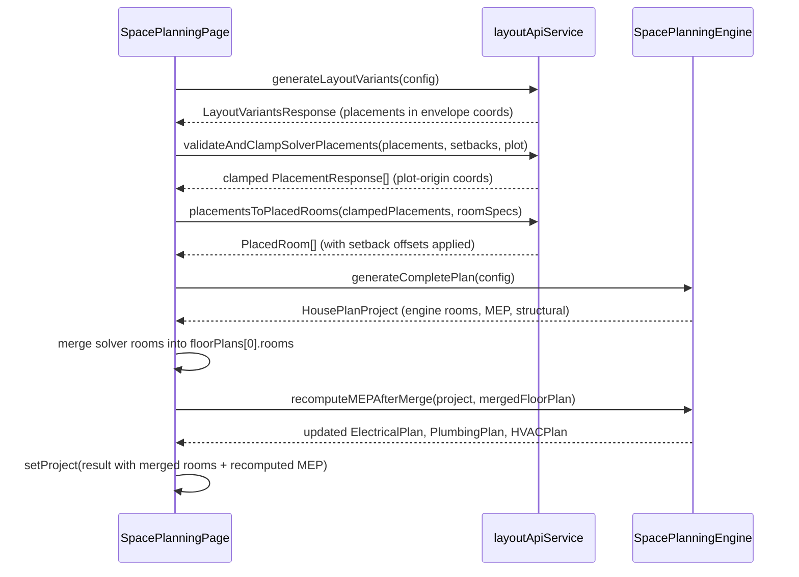

# Design Document: Space Planning Accuracy and Tools

## Overview

This document describes the technical design for three interconnected improvements to BeamLab:

1. **Space Planning Engine** — fixes room placement accuracy (boundary enforcement, overlap resolution, MEP realignment, structural grid coordination) and upgrades elevation/section views from placeholder SVGs to dimensioned architectural drawings derived from actual room data.

2. **Sensitivity & Optimization Dashboard** — extends the optimizer to support multi-objective Pareto-front exploration, real-time convergence visualization, a working parameter study tab, and export of optimized sections back to the model store.

3. **Structural Detailing Center** — replaces the static overview card grid with a live pass/fail member dashboard, adds batch design, reinforcement drawing export, and a self-contained HTML design report generator.

### Key Design Decisions

- **Coordinate system**: Solver placements use buildable-envelope-relative coordinates (origin at setback corner). Engine rooms use plot-origin coordinates. The fix is to add setback offsets during the merge step, not inside the solver or engine.
- **MEP recompute**: MEP is regenerated after the solver merge, not before, so fixtures always reference final room positions.
- **Structural grid**: Columns snap to room corners (±0.15 m tolerance) rather than a pure arithmetic grid.
- **Elevation data flow**: `buildFrontElevation` / `buildSectionAA` derive all geometry from `FloorPlan[]` + `StructuralPlan` — no separate elevation data store.
- **Pareto front**: Computed client-side from the existing section-sweep candidates; no new backend endpoint required.
- **Batch design**: Runs synchronously in a Web Worker to avoid blocking the UI thread.
- **Serialization**: `JSON.stringify` / `JSON.parse` with a `Date` reviver; no third-party serialization library.

---

## Architecture

### Component Interaction Diagram

```mermaid
graph TD
    subgraph "Space Planning Page"
        SPP[SpacePlanningPage.tsx]
        WIZ[RoomConfigWizard]
        FPR[FloorPlanRenderer]
        ESV[ElevationSectionViewer]
        VSel[VariantSelector]
        CSC[ConstraintScorecard]
    end

    subgraph "Space Planning Engine"
        SPE[SpacePlanningEngine.ts]
        CLAMP[clampToEnvelope]
        OVERLAP[detectOverlaps / resolveOverlaps]
        SNAP[snapColumnsToRoomCorners]
        MEP_R[recomputeMEPAfterMerge]
        ELEV[buildFrontElevation / buildSectionAA]
    end

    subgraph "Layout API Service"
        LAS[layoutApiService.ts]
        P2R[placementsToPlacedRooms]
        VCSR[validateAndClampSolverPlacements]
    end

    subgraph "Optimization Dashboard"
        SOD[SensitivityOptimizationDashboard.tsx]
        PARETO[computeParetoFront]
        CONV[ConvergenceChart]
        PSTUDY[ParameterStudyPanel]
        APPLY[applyOptimizedSections]
    end

    subgraph "Detailing Center"
        DDP[DetailingDesignPage.tsx]
        BATCH[runBatchDesign]
        MST[MemberStatusTable]
        RSVG[generateReinforcementSVG]
        RHTML[generateDesignReportHTML]
    end

    subgraph "Serialization"
        SER[projectSerializer.ts]
    end

    subgraph "Model Store"
        MS[(modelStore)]
    end

    WIZ -->|WizardConfig| SPP
    SPP -->|WizardConfig| LAS
    LAS -->|LayoutVariantsResponse| SPP
    SPP -->|PlacementResponse[]| VCSR
    VCSR -->|clamped PlacementResponse[]| P2R
    P2R -->|PlacedRoom[]| SPP
    SPP -->|config| SPE
    SPE -->|HousePlanProject| SPP
    SPP -->|mergedRooms| MEP_R
    MEP_R -->|updated MEP| SPP
    SPE --> CLAMP
    SPE --> OVERLAP
    SPE --> SNAP
    SPE --> ELEV
    SPP -->|FloorPlan[]| FPR
    SPP -->|ElevationView[]| ESV
    SPP -->|ConstraintReport| CSC
    SPP -->|VariantResponse[]| VSel

    SOD -->|sectionAssignments| MS
    SOD --> PARETO
    SOD --> CONV
    SOD --> PSTUDY
    SOD --> APPLY
    APPLY -->|updated sectionIds| MS

    DDP --> BATCH
    DDP --> MST
    DDP --> RSVG
    DDP --> RHTML
    BATCH -->|MemberDesignResult[]| DDP

    SPP --> SER
    SER -->|JSON string| SPP
```

### Data Flow: Solver Merge (Bug Fix)



---

## Components and Interfaces

### 1. Space Planning Engine Changes

#### 1.1 New Utility Functions in `SpacePlanningEngine.ts`

```typescript
/**
 * Clamps a single room to the buildable envelope.
 * Returns the clamped room and whether any correction was applied.
 */
function clampToEnvelope(
  room: PlacedRoom,
  setbacks: SetbackRequirements,
  plot: PlotDimensions
): { room: PlacedRoom; corrected: boolean; deltaX: number; deltaY: number }

/**
 * Detects all overlapping room pairs (AABB intersection area > 0.01 m²).
 * Returns pairs sorted by penetration depth descending.
 */
function detectOverlaps(
  rooms: PlacedRoom[]
): Array<{ a: PlacedRoom; b: PlacedRoom; overlapArea: number; penetrationX: number; penetrationY: number }>

/**
 * Resolves overlaps by translating the lower-priority room along the
 * axis of minimum penetration depth. Mutates rooms in place.
 * Priority order: essential > important > desirable > optional.
 * Returns the number of overlaps resolved.
 */
function resolveOverlaps(
  rooms: PlacedRoom[],
  setbacks: SetbackRequirements,
  plot: PlotDimensions,
  maxPasses?: number   // default 10
): number

/**
 * Computes the adjacency score for a candidate position.
 * Score = Σ shared-wall-length with adjacentTo rooms
 *       - Σ shared-wall-length with awayFrom rooms
 */
function computeAdjacencyScore(
  candidate: { x: number; y: number; width: number; height: number },
  spec: RoomSpec,
  placedRooms: PlacedRoom[]
): number

/**
 * Snaps each column to the nearest room corner within tolerance.
 * Returns updated columns (does not mutate input).
 */
function snapColumnsToRoomCorners(
  columns: ColumnSpec[],
  rooms: PlacedRoom[],
  tolerance?: number   // default 0.15 m
): ColumnSpec[]

/**
 * Returns 0–100: percentage of room corners that have a column within tolerance.
 */
function computeGridAlignmentScore(
  columns: ColumnSpec[],
  rooms: PlacedRoom[],
  tolerance?: number   // default 0.15 m
): number

/**
 * Regenerates electrical, plumbing, and HVAC plans using the updated
 * room positions in mergedFloorPlan. Called after solver merge.
 */
function recomputeMEPAfterMerge(
  project: HousePlanProject,
  mergedFloorPlan: FloorPlan
): { electrical: ElectricalPlan; plumbing: PlumbingPlan; hvac: HVACPlan }
```

#### 1.2 New Function in `layoutApiService.ts`

```typescript
/**
 * Validates solver placements against the buildable envelope and adds
 * setback offsets so coordinates are relative to the plot origin.
 *
 * The CSP solver returns coordinates relative to the buildable envelope
 * origin (0,0). This function:
 *   1. Adds setback.left to x, setback.front to y
 *   2. Clamps to ensure room fits within plot - setback.right / setback.rear
 *   3. Logs a warning for any room that required clamping
 *
 * Must be called BEFORE placementsToPlacedRooms().
 */
export function validateAndClampSolverPlacements(
  placements: PlacementResponse[],
  setbacks: SetbackRequirements,
  plot: PlotDimensions
): PlacementResponse[]
```

#### 1.3 Type Extensions

```typescript
// Extend FloorPlan in types.ts
export interface FloorPlan {
  // ... existing fields ...
  boundaryViolationCount: number;   // rooms clamped during placement
  overlapCount: number;             // overlaps detected before resolution
  constraintViolations: ConstraintViolationRecord[];  // adjacency/placement violations
}

export interface ConstraintViolationRecord {
  type: 'boundary' | 'overlap' | 'adjacency' | 'structural';
  roomId: string;
  message: string;
  severity: 'error' | 'warning';
}

// Extend StructuralPlan in types.ts
export interface StructuralPlan {
  // ... existing fields ...
  gridAlignmentScore: number;  // 0–100
}
```

#### 1.4 Changes to `handleGenerate` / `handleGenerateVariants` in `SpacePlanningPage.tsx`

The merge sequence must be:

```typescript
// STEP 1: Validate and add setback offsets to solver placements
const clampedPlacements = validateAndClampSolverPlacements(
  bestVariant.placements,
  config.constraints.setbacks,
  config.plot
);

// STEP 2: Convert to PlacedRoom objects
const optimizedRooms = placementsToPlacedRooms(clampedPlacements, config.roomSpecs);

// STEP 3: Merge into engine floor plan
const mergedRooms = basePlan.rooms.map((engineRoom) => {
  const solverRoom = optimizedRooms.find(
    (sr) => sr.id === engineRoom.id || sr.spec.type === engineRoom.spec.type
  );
  return solverRoom
    ? { ...engineRoom, x: solverRoom.x, y: solverRoom.y, width: solverRoom.width, height: solverRoom.height }
    : engineRoom;
});

// STEP 4: Resolve overlaps after merge
const resolvedRooms = [...mergedRooms];
const overlapCount = resolveOverlaps(resolvedRooms, config.constraints.setbacks, config.plot);
const mergedFloorPlan: FloorPlan = {
  ...basePlan,
  rooms: resolvedRooms,
  boundaryViolationCount: clampedPlacements.filter(p => p._wasClamped).length,
  overlapCount,
  constraintViolations: [],
};

// STEP 5: Recompute MEP using updated room positions
const { electrical, plumbing, hvac } = recomputeMEPAfterMerge(result, mergedFloorPlan);
result.floorPlans[0] = mergedFloorPlan;
result.electrical = electrical;
result.plumbing = plumbing;
result.hvac = hvac;
```

### 2. Elevation / Section Viewer Redesign

#### 2.1 New Builder Functions (added to `SpacePlanningEngine.ts`)

```typescript
/**
 * Builds a front elevation ElevationView from actual floor plan data.
 *
 * Coordinate system:
 *   X = horizontal position along plot width (metres)
 *   Y = vertical height above ground level (metres)
 *
 * Algorithm:
 *   1. For each floor, collect rooms whose front face (y == setback.front) is visible
 *   2. Draw wall outline as a polygon: left edge, top edge, right edge, ground
 *   3. For each room on the front face, draw window/door openings
 *   4. Add slab lines at each floor level
 *   5. Add dimension lines (total width, per-room widths, floor heights)
 *   6. Add north arrow (top-right) and scale bar (bottom-right)
 */
export function buildFrontElevation(
  floorPlans: FloorPlan[],
  structural: StructuralPlan,
  plot: PlotDimensions,
  setbacks: SetbackRequirements
): ElevationView

/**
 * Builds a rear elevation (mirror of front along plot depth axis).
 */
export function buildRearElevation(
  floorPlans: FloorPlan[],
  structural: StructuralPlan,
  plot: PlotDimensions,
  setbacks: SetbackRequirements
): ElevationView

/**
 * Builds a left-side elevation.
 * X axis = plot depth, Y axis = building height.
 */
export function buildLeftElevation(
  floorPlans: FloorPlan[],
  structural: StructuralPlan,
  plot: PlotDimensions,
  setbacks: SetbackRequirements
): ElevationView

/**
 * Builds a right-side elevation.
 */
export function buildRightElevation(
  floorPlans: FloorPlan[],
  structural: StructuralPlan,
  plot: PlotDimensions,
  setbacks: SetbackRequirements
): ElevationView

/**
 * Builds a vertical section cut along a horizontal line at y = sectionLine.startY.
 * Shows rooms in cross-section with slab, beam, and floor labels.
 */
export function buildSectionAA(
  floorPlans: FloorPlan[],
  structural: StructuralPlan,
  sectionLine: SectionLine,
  plot: PlotDimensions
): ElevationView

/**
 * Builds a vertical section cut along a vertical line at x = sectionLine.startX.
 */
export function buildSectionBB(
  floorPlans: FloorPlan[],
  structural: StructuralPlan,
  sectionLine: SectionLine,
  plot: PlotDimensions
): ElevationView
```

#### 2.2 SVG Rendering Details

The `ElevationSectionViewer` component already renders `ElevationView` objects correctly. The fix is in the data — `generateElevation()` in `SpacePlanningEngine.ts` currently produces placeholder shapes. It will be replaced by calls to `buildFrontElevation` etc.

**North Arrow**: Added as a group of `ElevationElement` with type `'wall'` forming an arrow polygon at coordinates `(plotWidth + 1, totalHeight + 1)` in elevation space, plus a `TextLabel` "N".

**Scale Bar**: Added as a `DimensionLine` at the bottom of the drawing spanning exactly 1 metre, labelled "1m".

**Door openings**: Rendered as a gap in the wall polygon. For each `DoorSpec` on the front-facing wall of a room, the wall polygon is split: left segment, gap (door width), right segment.

**Window openings**: Rendered as a filled rectangle with lighter fill inside the wall polygon at the correct sill height.

#### 2.3 Updated `generateCompletePlan` Call

After generating the engine plan, replace the elevation/section generation:

```typescript
// In generateCompletePlan():
const elevations: ElevationView[] = [
  buildFrontElevation(floorPlans, structural, plot, constraints.setbacks),
  buildRearElevation(floorPlans, structural, plot, constraints.setbacks),
  buildLeftElevation(floorPlans, structural, plot, constraints.setbacks),
  buildRightElevation(floorPlans, structural, plot, constraints.setbacks),
];
const sections: ElevationView[] = [
  buildSectionAA(floorPlans, structural, sectionLines[0], plot),
  buildSectionBB(floorPlans, structural, sectionLines[1], plot),
];
```

### 3. Optimization Dashboard Redesign

#### 3.1 New Types

```typescript
// In SensitivityOptimizationDashboard.tsx (or a co-located types file)

export interface ParetoPoint {
  id: string;
  sectionAssignments: Record<string, string>;  // memberId → sectionDesignation
  weight: number;       // kg
  displacement: number; // mm (max nodal displacement)
  cost: number;         // relative cost index
  stiffness: number;    // kN/mm (global stiffness proxy)
  dominated: boolean;   // true if dominated by another point
}

export interface ConvergenceEntry {
  iteration: number;
  objectiveValue: number;
  timestamp: number;  // ms since run start
}

export interface ParameterStudyConfig {
  variable1: { variableId: string; lowerBound: number; upperBound: number; steps: number };
  variable2?: { variableId: string; lowerBound: number; upperBound: number; steps: number };
  objective: ObjectiveType;
}

export interface ParameterStudyResult {
  v1Value: number;
  v2Value?: number;
  objectiveValue: number;
  isMinimum: boolean;
}
```

#### 3.2 New Pure Functions

```typescript
/**
 * Non-dominated sorting: returns only the Pareto-optimal points.
 * A point p dominates q if p is at least as good on all objectives
 * and strictly better on at least one.
 * Objectives: weight (minimize), displacement (minimize), cost (minimize), stiffness (maximize).
 */
export function computeParetoFront(
  candidates: ParetoPoint[],
  objectives: Array<'weight' | 'displacement' | 'cost' | 'stiffness'>
): ParetoPoint[]

/**
 * Evaluates the objective function for a given section assignment.
 * Uses the current analysis results from the model store.
 */
export function evaluateObjective(
  sectionAssignments: Record<string, string>,
  objective: ObjectiveType,
  members: Map<string, Member>,
  analysisResults: AnalysisResults | null,
  nodes: Map<string, ModelNode>
): number

/**
 * Runs a parameter study sweep.
 * For 1D: evaluates at each step value of variable1.
 * For 2D: evaluates at each combination of variable1 × variable2.
 * Returns results sorted by v1Value (then v2Value for 2D).
 */
export function runParameterStudy(
  config: ParameterStudyConfig,
  variables: DesignVariable[],
  members: Map<string, Member>,
  analysisResults: AnalysisResults | null,
  nodes: Map<string, ModelNode>
): ParameterStudyResult[]

/**
 * Applies optimized section assignments to the model store.
 * Returns the previous assignments for undo support.
 */
export function applyOptimizedSections(
  optimizedAssignments: Record<string, string>,
  updateMember: (id: string, patch: Partial<Member>) => void,
  members: Map<string, Member>
): Record<string, string>  // previousAssignments
```

#### 3.3 New Components

**`ParetoScatterPlot`** (`apps/web/src/components/design/ParetoScatterPlot.tsx`):

```typescript
interface ParetoScatterPlotProps {
  points: ParetoPoint[];
  xAxis: 'weight' | 'displacement' | 'cost' | 'stiffness';
  yAxis: 'weight' | 'displacement' | 'cost' | 'stiffness';
  selectedPointId: string | null;
  onPointClick: (pointId: string) => void;
  width?: number;   // default 400
  height?: number;  // default 300
}
```

Renders an SVG scatter plot. Pareto-optimal points are filled circles; dominated points are hollow. Axes are labelled with units. Clicking a point calls `onPointClick`.

**`ConvergenceChart`** (`apps/web/src/components/design/ConvergenceChart.tsx`):

```typescript
interface ConvergenceChartProps {
  history: ConvergenceEntry[];
  convergenceTolerance: number;
  isRunning: boolean;
  width?: number;   // default 400
  height?: number;  // default 200
}
```

Renders an SVG line chart. Updates via `requestAnimationFrame` when `isRunning` is true. Shows a horizontal dashed line at the best value. Annotates the final value when `isRunning` is false.

**`ParameterStudyPanel`** (`apps/web/src/components/design/ParameterStudyPanel.tsx`):

```typescript
interface ParameterStudyPanelProps {
  variables: DesignVariable[];
  members: Map<string, Member>;
  analysisResults: AnalysisResults | null;
  nodes: Map<string, ModelNode>;
  onResultsReady: (results: ParameterStudyResult[], config: ParameterStudyConfig) => void;
}
```

Contains: variable selector dropdowns, lower/upper bound inputs, step count input, "Run Study" button. Renders a 1D line chart (SVG) or 2D heat map (SVG with colour-encoded cells) depending on whether one or two variables are selected. Highlights the minimum point.

#### 3.4 State Additions to `SensitivityOptimizationDashboard`

```typescript
const [paretoFront, setParetoFront] = useState<ParetoPoint[]>([]);
const [allCandidates, setAllCandidates] = useState<ParetoPoint[]>([]);
const [selectedParetoPointId, setSelectedParetoPointId] = useState<string | null>(null);
const [convergenceHistory, setConvergenceHistory] = useState<ConvergenceEntry[]>([]);
const [paramStudyResults, setParamStudyResults] = useState<ParameterStudyResult[]>([]);
const [paramStudyConfig, setParamStudyConfig] = useState<ParameterStudyConfig | null>(null);
const [optimizedAssignments, setOptimizedAssignments] = useState<Record<string, string>>({});
const [previousAssignments, setPreviousAssignments] = useState<Record<string, string>>({});
const [sectionsApplied, setSectionsApplied] = useState(false);
const [paretoObjectiveX, setParetoObjectiveX] = useState<'weight' | 'displacement'>('weight');
const [paretoObjectiveY, setParetoObjectiveY] = useState<'displacement' | 'cost'>('displacement');
```

#### 3.5 Convergence Detection Logic

```typescript
function isConverged(history: ConvergenceEntry[], tolerance: number): boolean {
  if (history.length < 10) return false;
  const last10 = history.slice(-10);
  const maxVal = Math.max(...last10.map(e => e.objectiveValue));
  const minVal = Math.min(...last10.map(e => e.objectiveValue));
  return (maxVal - minVal) / Math.max(Math.abs(minVal), 1e-10) < tolerance;
}
```

### 4. Detailing Page Redesign

#### 4.1 New Types

```typescript
// In DetailingDesignPage.tsx (or a co-located types file)

export type MemberDesignStatus = 'pass' | 'fail' | 'skipped' | 'pending';

export interface MemberDesignResult {
  memberId: string;
  memberType: 'beam' | 'column' | 'brace';
  sectionId: string;
  utilizationRatio: number;
  status: MemberDesignStatus;
  governingCheck: string;       // e.g. "Flexure (IS 456 Cl. 26.5)"
  appliedMoment: number;        // kN·m
  appliedShear: number;         // kN
  appliedAxial: number;         // kN
  capacityMoment: number;       // kN·m
  capacityShear: number;        // kN
  designOutput?: RCDesignOutput | SteelDesignOutput;
  skipReason?: string;
}

export interface RCDesignOutput {
  tensionSteel: number;         // mm²
  compressionSteel: number;     // mm²
  stirrupSpacing: number;       // mm
  barDiameter: number;          // mm
  numBars: number;
  cover: number;                // mm
}

export interface SteelDesignOutput {
  classification: 'plastic' | 'compact' | 'semi-compact' | 'slender';
  ltbCheck: number;             // utilization ratio
  webBuckling: number;          // utilization ratio
}
```

#### 4.2 New Functions

```typescript
/**
 * Runs IS 456 / IS 800 code checks on all members.
 * Uses the maximum force envelope from analysisResults.
 * Members with missing section data are marked as 'skipped'.
 *
 * Performance target: ≤ 5 seconds for 200 members.
 * Implementation: synchronous loop (no async needed for client-side checks).
 */
export function runBatchDesign(
  members: Map<string, Member>,
  analysisResults: AnalysisResults,
  nodes: Map<string, ModelNode>,
  sections: SteelSectionProperties[]
): MemberDesignResult[]

/**
 * Computes summary statistics from batch results.
 */
export function computeDesignSummary(results: MemberDesignResult[]): {
  total: number;
  pass: number;
  fail: number;
  skipped: number;
  passRate: number;  // 0–100
}

/**
 * Generates an SVG reinforcement cross-section sketch for an RC member.
 * Returns a complete SVG string (not a React element).
 *
 * SVG contents:
 *   - Rectangular cross-section outline
 *   - Cover dimension lines (dashed)
 *   - Bar circles at correct positions
 *   - Stirrup rectangle
 *   - Bar diameter and spacing labels
 *   - Title block (member ID, section, code, date)
 */
export function generateReinforcementSVG(
  result: MemberDesignResult,
  projectName: string
): string

/**
 * Generates a self-contained HTML design report.
 * No external CSS or script references — all styles are inline.
 *
 * Report structure:
 *   1. Cover: project name, date, design code
 *   2. Summary table: all members with utilization ratio and status
 *   3. Per-member calculation sheets: forces, section properties, code checks
 */
export function generateDesignReportHTML(
  results: MemberDesignResult[],
  projectName: string,
  designCode: string
): string
```

#### 4.3 New Components

**`MemberStatusTable`** (`apps/web/src/components/design/MemberStatusTable.tsx`):

```typescript
interface MemberStatusTableProps {
  results: MemberDesignResult[];
  selectedMemberId: string | null;
  onMemberClick: (memberId: string, memberType: 'beam' | 'column' | 'brace') => void;
  sortBy?: 'utilizationRatio' | 'memberId' | 'status';
  sortDir?: 'asc' | 'desc';
}
```

Renders a sortable table. Row colour coding:
- Green (`bg-green-50 dark:bg-green-900/20`): `utilizationRatio <= 0.85`
- Amber (`bg-amber-50 dark:bg-amber-900/20`): `0.85 < utilizationRatio <= 1.0`
- Red (`bg-red-50 dark:bg-red-900/20`): `utilizationRatio > 1.0`
- Grey (`bg-slate-50 dark:bg-slate-800`): `status === 'skipped'`

**`DesignSummaryBar`** (`apps/web/src/components/design/DesignSummaryBar.tsx`):

```typescript
interface DesignSummaryBarProps {
  summary: { total: number; pass: number; fail: number; skipped: number; passRate: number };
  onBatchDesign: () => void;
  onGenerateReport: () => void;
  isBatchRunning: boolean;
  hasResults: boolean;
}
```

#### 4.4 State Additions to `DetailingDesignPage`

```typescript
const [batchResults, setBatchResults] = useState<MemberDesignResult[]>([]);
const [selectedMemberId, setSelectedMemberId] = useState<string | null>(null);
const [isBatchRunning, setIsBatchRunning] = useState(false);
const [sortBy, setSortBy] = useState<'utilizationRatio' | 'memberId' | 'status'>('utilizationRatio');
const [sortDir, setSortDir] = useState<'asc' | 'desc'>('desc');
```

#### 4.5 Updated Overview Tab

Replace the static `OverviewCard` grid with:

```tsx
{activeTab === 'overview' && (
  <>
    <DesignSummaryBar
      summary={computeDesignSummary(batchResults)}
      onBatchDesign={handleBatchDesign}
      onGenerateReport={handleGenerateReport}
      isBatchRunning={isBatchRunning}
      hasResults={batchResults.length > 0}
    />
    {batchResults.length > 0 ? (
      <MemberStatusTable
        results={batchResults}
        selectedMemberId={selectedMemberId}
        onMemberClick={handleMemberClick}
        sortBy={sortBy}
        sortDir={sortDir}
      />
    ) : (
      <NoAnalysisPrompt hasAnalysis={hasAnalysis} />
    )}
  </>
)}
```

### 5. Round-Trip Serialization

#### 5.1 New File: `apps/web/src/services/space-planning/projectSerializer.ts`

```typescript
/**
 * Serializes a HousePlanProject to a JSON string.
 * Handles Date objects by converting to ISO strings.
 */
export function serializeProject(project: HousePlanProject): string {
  return JSON.stringify(project);
}

/**
 * Deserializes a JSON string to a HousePlanProject.
 * Revives Date fields (createdAt, updatedAt).
 * Returns { error: string } if the string is malformed or missing required fields.
 */
export function deserializeProject(
  json: string
): HousePlanProject | { error: string } {
  try {
    const parsed = JSON.parse(json, dateReviver);
    const validation = validateProjectShape(parsed);
    if (!validation.valid) {
      return { error: `Invalid project structure: ${validation.reason}` };
    }
    return parsed as HousePlanProject;
  } catch (e) {
    return { error: `JSON parse error: ${e instanceof Error ? e.message : String(e)}` };
  }
}

/** Revives ISO date strings back to Date objects */
function dateReviver(_key: string, value: unknown): unknown {
  if (typeof value === 'string' && /^\d{4}-\d{2}-\d{2}T/.test(value)) {
    return new Date(value);
  }
  return value;
}

/** Validates that the parsed object has the minimum required shape */
function validateProjectShape(obj: unknown): { valid: boolean; reason?: string } {
  if (!obj || typeof obj !== 'object') return { valid: false, reason: 'not an object' };
  const p = obj as Record<string, unknown>;
  if (!p.id || typeof p.id !== 'string') return { valid: false, reason: 'missing id' };
  if (!Array.isArray(p.floorPlans)) return { valid: false, reason: 'missing floorPlans' };
  if (!p.plot || typeof p.plot !== 'object') return { valid: false, reason: 'missing plot' };
  if (!p.structural || typeof p.structural !== 'object') return { valid: false, reason: 'missing structural' };
  return { valid: true };
}
```

---

## Data Models

### Extended `FloorPlan`

```typescript
export interface FloorPlan {
  floor: number;
  label: string;
  rooms: PlacedRoom[];
  staircases: StaircaseSpec[];
  corridors: { x: number; y: number; width: number; height: number }[];
  floorHeight: number;
  slabThickness: number;
  walls: WallSegment[];
  // NEW:
  boundaryViolationCount: number;
  overlapCount: number;
  constraintViolations: ConstraintViolationRecord[];
}
```

### Extended `StructuralPlan`

```typescript
export interface StructuralPlan {
  columns: ColumnSpec[];
  beams: BeamSpec[];
  foundations: FoundationSpec[];
  slabType: 'one_way' | 'two_way' | 'flat' | 'ribbed' | 'post_tensioned';
  slabThickness: number;
  // NEW:
  gridAlignmentScore: number;
}
```

### `PlacementResponse` Extension (internal, not exported)

```typescript
// Internal marker added by validateAndClampSolverPlacements
interface ClampedPlacementResponse extends PlacementResponse {
  _wasClamped: boolean;
  _clampDeltaX: number;
  _clampDeltaY: number;
}
```

---

## Correctness Properties

*A property is a characteristic or behavior that should hold true across all valid executions of a system — essentially, a formal statement about what the system should do. Properties serve as the bridge between human-readable specifications and machine-verifiable correctness guarantees.*

### Property 1: Boundary Invariant After Clamp

*For any* plot dimensions, setback requirements, and set of PlacedRooms, after calling `clampToEnvelope` on each room, every room must satisfy:
- `room.x >= setbacks.left`
- `room.y >= setbacks.front`
- `room.x + room.width <= plot.width - setbacks.right`
- `room.y + room.height <= plot.depth - setbacks.rear`

**Validates: Requirements 1.1, 1.2**

---

### Property 2: No-Overlap Invariant After Resolution

*For any* set of PlacedRooms, after calling `resolveOverlaps`, no two rooms shall have an AABB intersection area greater than 0.01 m².

Formally: `∀ i ≠ j: intersectionArea(rooms[i], rooms[j]) ≤ 0.01`

**Validates: Requirements 1.4, 1.5**

---

### Property 3: MEP Containment Invariant

*For any* floor plan, after calling `recomputeMEPAfterMerge`, every electrical fixture, plumbing fixture, and HVAC equipment item must satisfy:
- `fixture.x >= room.x`
- `fixture.x <= room.x + room.width`
- `fixture.y >= room.y`
- `fixture.y <= room.y + room.height`

where `room` is the PlacedRoom with `id === fixture.roomId`.

**Validates: Requirements 4.1, 4.2, 4.3, 4.4, 4.5**

---

### Property 4: Adjacency Score Monotonicity

*For any* room spec with a non-empty `adjacentTo` list, placing the room with a shared wall with an `adjacentTo` room must produce a strictly higher adjacency score than placing it with no shared wall with any `adjacentTo` room.

Formally: `computeAdjacencyScore(sharedWallPosition, spec, rooms) > computeAdjacencyScore(isolatedPosition, spec, rooms)` when `sharedWallLength > 0`.

**Validates: Requirements 2.1, 2.2**

---

### Property 5: Column Snap Tolerance

*For any* set of rooms and columns, after calling `snapColumnsToRoomCorners(columns, rooms, 0.15)`, every column must be within 0.15 m of at least one room corner.

Formally: `∀ col: min(distance(col, corner) for corner in allRoomCorners(rooms)) ≤ 0.15`

**Validates: Requirements 3.1**

---

### Property 6: Grid Alignment Score Bounds

*For any* structural plan, `gridAlignmentScore` must be in the range [0, 100]. Furthermore, if every room corner has a column within 0.15 m, the score must equal 100.

**Validates: Requirements 3.5**

---

### Property 7: Elevation Width Matches Plot

*For any* set of floor plans and plot dimensions, the front elevation generated by `buildFrontElevation` must have a total horizontal span equal to `plot.width - setbacks.left - setbacks.right` (the buildable width).

Formally: `max(el.points.map(p => p.x)) - min(el.points.map(p => p.x)) === buildableWidth` for the outermost wall element.

**Validates: Requirements 5.1**

---

### Property 8: Elevation Contains North Arrow and Scale Bar

*For any* elevation or section view generated by the builder functions, the `labels` array must contain at least one entry with text "N" (north arrow) and the `dimensions` array must contain at least one entry labelled with a metre value (scale bar).

**Validates: Requirements 5.6**

---

### Property 9: Pareto Non-Domination

*For any* set of candidate solutions, the Pareto front computed by `computeParetoFront` must contain only non-dominated solutions: no point in the front is dominated by any other point in the front.

Formally: `∀ p, q ∈ paretoFront, p ≠ q: ¬dominates(p, q) ∧ ¬dominates(q, p)`

where `dominates(p, q)` means p is at least as good as q on all objectives and strictly better on at least one.

**Validates: Requirements 6.1**

---

### Property 10: Pareto Point Labels Contain Required Fields

*For any* Pareto point, the rendered label must contain the total weight in kg and the maximum displacement in mm.

**Validates: Requirements 6.5**

---

### Property 11: Convergence Indicator Correctness

*For any* convergence history of length ≥ 10, the convergence indicator must show "Converged" if and only if the relative change in objective value over the last 10 iterations is less than the convergence tolerance.

Formally: `isConverged(history, tol) ↔ (max(last10) - min(last10)) / max(|min(last10)|, ε) < tol`

**Validates: Requirements 7.3**

---

### Property 12: Parameter Study Completeness

*For any* parameter study configuration with `n1` steps for variable 1 and `n2` steps for variable 2 (or 1 if only one variable), `runParameterStudy` must return exactly `n1 × n2` results.

**Validates: Requirements 8.2, 8.3**

---

### Property 13: Parameter Study Minimum Correctness

*For any* parameter study results, the entry marked `isMinimum = true` must have the lowest `objectiveValue` among all entries.

Formally: `∀ r ∈ results: r.isMinimum → r.objectiveValue = min(results.map(x => x.objectiveValue))`

**Validates: Requirements 8.5**

---

### Property 14: Apply-Then-Revert Round Trip

*For any* set of optimized section assignments, applying them to the model and then reverting must restore every member's `sectionId` to its original value.

Formally: `∀ memberId: revert(apply(assignments))[memberId].sectionId = original[memberId].sectionId`

**Validates: Requirements 9.2, 9.4**

---

### Property 15: Batch Design Completeness

*For any* model with N members and available analysis results, `runBatchDesign` must return exactly N results, each with status `'pass'`, `'fail'`, or `'skipped'`.

Formally: `runBatchDesign(members, ...).length === members.size`

**Validates: Requirements 10.1, 11.1**

---

### Property 16: Design Summary Correctness

*For any* batch results, `computeDesignSummary` must satisfy:
- `summary.total === results.length`
- `summary.pass + summary.fail + summary.skipped === summary.total`
- `summary.passRate === (summary.pass / summary.total) * 100`

**Validates: Requirements 10.4**

---

### Property 17: Reinforcement SVG Contains Required Elements

*For any* `MemberDesignResult` with `status !== 'skipped'`, `generateReinforcementSVG` must return an SVG string that contains:
- At least one `<circle>` element (reinforcement bars)
- At least one `<rect>` element (section outline or stirrup)
- A title block containing the `memberId`

**Validates: Requirements 12.2, 12.3**

---

### Property 18: Design Report is Self-Contained HTML

*For any* batch results, `generateDesignReportHTML` must return an HTML string that:
- Does not contain `<link` with `href` pointing to an external URL
- Does not contain `<script src=`
- Contains a `<table` element (summary table)
- Contains the project name

**Validates: Requirements 13.2, 13.5**

---

### Property 19: Round-Trip Serialization Preserves Coordinates

*For any* valid `HousePlanProject` `p`, `deserializeProject(serializeProject(p))` must produce a project where:
- Every `PlacedRoom` has identical `x`, `y`, `width`, `height` to the original
- Every `ElectricalFixture` has identical `x`, `y`, `roomId` to the original
- Every `PlumbingFixture` has identical `x`, `y`, `roomId` to the original

Formally: `∀ i, j: result.floorPlans[i].rooms[j].x === p.floorPlans[i].rooms[j].x` (and same for y, width, height, and MEP fixtures).

**Validates: Requirements 14.1, 14.2, 14.3, 14.4**

---

## Error Handling

### Space Planning Engine

| Error Condition | Handling |
|---|---|
| Solver placement outside plot | `validateAndClampSolverPlacements` clamps and sets `_wasClamped = true`; warning logged to console in dev mode |
| Overlap unresolvable after `maxPasses` | `resolveOverlaps` returns the count of remaining overlaps; `FloorPlan.overlapCount` reflects the residual |
| Room spec missing `adjacentTo` | `computeAdjacencyScore` returns 0 (neutral) |
| Column snap finds no room corners | Column stays at grid position; `gridAlignmentScore` reflects the miss |
| MEP fixture outside room after recompute | Warning logged; fixture is clamped to room bounds |

### Optimization Dashboard

| Error Condition | Handling |
|---|---|
| No feasible solutions for Pareto | `computeParetoFront` returns empty array; UI shows "No feasible solutions — try relaxing constraints" |
| Analysis results unavailable | `evaluateObjective` returns `Infinity`; point is excluded from Pareto front |
| Parameter study with 0 steps | `runParameterStudy` throws `RangeError('steps must be >= 2')`; UI shows validation error |
| Apply to model with no changes | "Apply to Model" button is disabled; no-op |

### Detailing Page

| Error Condition | Handling |
|---|---|
| Member section not in database | `runBatchDesign` marks member as `'skipped'` with `skipReason: 'Section not found'` |
| Analysis forces missing for member | `runBatchDesign` marks member as `'skipped'` with `skipReason: 'No analysis forces'` |
| SVG generation fails | `generateReinforcementSVG` returns a minimal error SVG with the error message in a `<text>` element |
| Report generation fails | `generateDesignReportHTML` returns a minimal HTML page with the error message |

### Serialization

| Error Condition | Handling |
|---|---|
| Malformed JSON | `deserializeProject` returns `{ error: 'JSON parse error: ...' }` |
| Missing required fields | `deserializeProject` returns `{ error: 'Invalid project structure: ...' }` |
| Date field not a valid ISO string | `dateReviver` leaves the value as a string; downstream code handles gracefully |

---

## Testing Strategy

### Dual Testing Approach

Both unit tests and property-based tests are required. Unit tests verify specific examples and edge cases; property tests verify universal correctness across many generated inputs.

### Property-Based Testing Library

Use **fast-check** (`npm install --save-dev fast-check`), which is already compatible with Vitest.

Each property test must run a minimum of **100 iterations** (fast-check default is 100).

Tag format for each test: `// Feature: space-planning-accuracy-and-tools, Property N: <property text>`

### Property Test Implementations

Each correctness property maps to exactly one property-based test:

**Property 1 — Boundary Invariant** (`clampToEnvelope.test.ts`):
```typescript
// Feature: space-planning-accuracy-and-tools, Property 1: Boundary invariant after clamp
fc.assert(fc.property(
  arbitraryPlot(), arbitrarySetbacks(), arbitraryPlacedRoom(),
  (plot, setbacks, room) => {
    const { room: clamped } = clampToEnvelope(room, setbacks, plot);
    return (
      clamped.x >= setbacks.left &&
      clamped.y >= setbacks.front &&
      clamped.x + clamped.width <= plot.width - setbacks.right &&
      clamped.y + clamped.height <= plot.depth - setbacks.rear
    );
  }
));
```

**Property 2 — No-Overlap Invariant** (`resolveOverlaps.test.ts`):
```typescript
// Feature: space-planning-accuracy-and-tools, Property 2: No-overlap invariant after resolution
fc.assert(fc.property(
  fc.array(arbitraryPlacedRoom(), { minLength: 2, maxLength: 10 }),
  arbitraryPlot(), arbitrarySetbacks(),
  (rooms, plot, setbacks) => {
    resolveOverlaps(rooms, setbacks, plot);
    for (let i = 0; i < rooms.length; i++) {
      for (let j = i + 1; j < rooms.length; j++) {
        if (intersectionArea(rooms[i], rooms[j]) > 0.01) return false;
      }
    }
    return true;
  }
));
```

**Property 3 — MEP Containment** (`recomputeMEP.test.ts`):
```typescript
// Feature: space-planning-accuracy-and-tools, Property 3: MEP containment invariant
fc.assert(fc.property(
  arbitraryHousePlanProject(), arbitraryFloorPlan(),
  (project, floorPlan) => {
    const { electrical, plumbing, hvac } = recomputeMEPAfterMerge(project, floorPlan);
    const roomMap = new Map(floorPlan.rooms.map(r => [r.id, r]));
    return [
      ...electrical.fixtures,
      ...plumbing.fixtures,
      ...hvac.equipment,
    ].every(f => {
      const room = roomMap.get(f.roomId);
      if (!room) return true; // room on different floor
      return f.x >= room.x && f.x <= room.x + room.width &&
             f.y >= room.y && f.y <= room.y + room.height;
    });
  }
));
```

**Property 9 — Pareto Non-Domination** (`computeParetoFront.test.ts`):
```typescript
// Feature: space-planning-accuracy-and-tools, Property 9: Pareto non-domination
fc.assert(fc.property(
  fc.array(arbitraryParetoPoint(), { minLength: 1, maxLength: 50 }),
  (candidates) => {
    const front = computeParetoFront(candidates, ['weight', 'displacement']);
    for (const p of front) {
      for (const q of front) {
        if (p.id !== q.id && dominates(p, q, ['weight', 'displacement'])) return false;
      }
    }
    return true;
  }
));
```

**Property 12 — Parameter Study Completeness** (`runParameterStudy.test.ts`):
```typescript
// Feature: space-planning-accuracy-and-tools, Property 12: Parameter study completeness
fc.assert(fc.property(
  arbitraryParameterStudyConfig(),
  (config) => {
    const results = runParameterStudy(config, mockVariables, mockMembers, null, mockNodes);
    const expected = config.variable1.steps * (config.variable2?.steps ?? 1);
    return results.length === expected;
  }
));
```

**Property 15 — Batch Design Completeness** (`runBatchDesign.test.ts`):
```typescript
// Feature: space-planning-accuracy-and-tools, Property 15: Batch design completeness
fc.assert(fc.property(
  fc.array(arbitraryMember(), { minLength: 1, maxLength: 50 }),
  (memberArray) => {
    const members = new Map(memberArray.map(m => [m.id, m]));
    const results = runBatchDesign(members, mockAnalysisResults, mockNodes, STEEL_SECTIONS);
    return results.length === members.size &&
           results.every(r => ['pass', 'fail', 'skipped'].includes(r.status));
  }
));
```

**Property 19 — Round-Trip Serialization** (`projectSerializer.test.ts`):
```typescript
// Feature: space-planning-accuracy-and-tools, Property 19: Round-trip serialization preserves coordinates
fc.assert(fc.property(
  arbitraryHousePlanProject(),
  (project) => {
    const result = deserializeProject(serializeProject(project));
    if ('error' in result) return false;
    return project.floorPlans.every((fp, i) =>
      fp.rooms.every((room, j) => {
        const r2 = result.floorPlans[i]?.rooms[j];
        return r2 && r2.x === room.x && r2.y === room.y &&
               r2.width === room.width && r2.height === room.height;
      })
    );
  }
));
```

### Unit Tests

Unit tests focus on specific examples and edge cases not covered by property tests:

- `clampToEnvelope`: room exactly at boundary (no correction needed), room entirely outside plot
- `detectOverlaps`: two rooms touching at edge (area = 0, not an overlap), three-way overlap
- `validateAndClampSolverPlacements`: solver room at (0,0) gets offset by setbacks
- `buildFrontElevation`: single-floor plan produces correct wall polygon points
- `computeDesignSummary`: all-pass, all-fail, mixed results
- `generateReinforcementSVG`: beam with 3 bars produces 3 `<circle>` elements
- `generateDesignReportHTML`: output contains no `<link href=` or `<script src=`
- `deserializeProject`: malformed JSON returns `{ error: ... }`, missing `floorPlans` returns `{ error: ... }`
- `isConverged`: history of 10 identical values → converged, history with large variance → not converged

### Test File Locations

```
apps/web/src/services/space-planning/__tests__/
  clampToEnvelope.test.ts
  resolveOverlaps.test.ts
  recomputeMEP.test.ts
  snapColumnsToRoomCorners.test.ts
  projectSerializer.test.ts
  validateAndClampSolverPlacements.test.ts
  buildElevation.test.ts

apps/web/src/components/design/__tests__/
  computeParetoFront.test.ts
  runParameterStudy.test.ts
  convergenceDetection.test.ts
  applyOptimizedSections.test.ts
  runBatchDesign.test.ts
  generateReinforcementSVG.test.ts
  generateDesignReportHTML.test.ts
  computeDesignSummary.test.ts
```

---

## File Change Map

### Files to Modify

| File | Changes |
|---|---|
| `apps/web/src/services/space-planning/types.ts` | Add `boundaryViolationCount`, `overlapCount`, `constraintViolations` to `FloorPlan`; add `gridAlignmentScore` to `StructuralPlan`; add `ConstraintViolationRecord` interface |
| `apps/web/src/services/space-planning/SpacePlanningEngine.ts` | Add `clampToEnvelope`, `detectOverlaps`, `resolveOverlaps`, `computeAdjacencyScore`, `snapColumnsToRoomCorners`, `computeGridAlignmentScore`, `recomputeMEPAfterMerge`, `buildFrontElevation`, `buildRearElevation`, `buildLeftElevation`, `buildRightElevation`, `buildSectionAA`, `buildSectionBB`; update `generateStructuralPlan` to call `snapColumnsToRoomCorners` and set `gridAlignmentScore`; update `generateCompletePlan` to call new elevation builders |
| `apps/web/src/services/space-planning/layoutApiService.ts` | Add `validateAndClampSolverPlacements`; extend `PlacementResponse` with internal `_wasClamped` marker |
| `apps/web/src/pages/SpacePlanningPage.tsx` | Fix merge order in `handleGenerate` and `handleGenerateVariants` and `handleSelectVariant` and `handleSelectCandidate`: call `validateAndClampSolverPlacements` before `placementsToPlacedRooms`, call `resolveOverlaps` after merge, call `recomputeMEPAfterMerge` after merge |
| `apps/web/src/components/space-planning/ElevationSectionViewer.tsx` | No logic changes needed — the component already renders `ElevationView` objects correctly. The fix is in the data produced by the engine. Minor: add null-safe guard when `allPoints` is empty |
| `apps/web/src/pages/SensitivityOptimizationDashboard.tsx` | Add `paretoFront`, `convergenceHistory`, `paramStudyResults`, `optimizedAssignments`, `previousAssignments` state; add `computeParetoFront`, `evaluateObjective`, `runParameterStudy`, `applyOptimizedSections` functions; integrate `ParetoScatterPlot`, `ConvergenceChart`, `ParameterStudyPanel` components; add "Apply to Model" and "Revert" buttons; update `runOptimization` to populate `convergenceHistory` and `allCandidates` |
| `apps/web/src/pages/DetailingDesignPage.tsx` | Add `batchResults`, `selectedMemberId`, `isBatchRunning` state; add `handleBatchDesign`, `handleMemberClick`, `handleExportDrawing`, `handleGenerateReport` handlers; replace static overview card grid with `DesignSummaryBar` + `MemberStatusTable`; add `runBatchDesign`, `computeDesignSummary`, `generateReinforcementSVG`, `generateDesignReportHTML` functions |

### Files to Create

| File | Purpose |
|---|---|
| `apps/web/src/services/space-planning/projectSerializer.ts` | `serializeProject` and `deserializeProject` with Date reviver and shape validation |
| `apps/web/src/components/design/ParetoScatterPlot.tsx` | SVG scatter plot for Pareto front visualization |
| `apps/web/src/components/design/ConvergenceChart.tsx` | SVG line chart for real-time convergence visualization |
| `apps/web/src/components/design/ParameterStudyPanel.tsx` | Variable selector, range inputs, 1D/2D chart for parameter studies |
| `apps/web/src/components/design/MemberStatusTable.tsx` | Sortable, colour-coded member design status table |
| `apps/web/src/components/design/DesignSummaryBar.tsx` | Summary bar with pass/fail counts and action buttons |
| `apps/web/src/services/space-planning/__tests__/clampToEnvelope.test.ts` | Property + unit tests for boundary clamping |
| `apps/web/src/services/space-planning/__tests__/resolveOverlaps.test.ts` | Property + unit tests for overlap resolution |
| `apps/web/src/services/space-planning/__tests__/recomputeMEP.test.ts` | Property tests for MEP containment |
| `apps/web/src/services/space-planning/__tests__/snapColumnsToRoomCorners.test.ts` | Property tests for column snapping |
| `apps/web/src/services/space-planning/__tests__/projectSerializer.test.ts` | Property + unit tests for round-trip serialization |
| `apps/web/src/services/space-planning/__tests__/validateAndClampSolverPlacements.test.ts` | Unit tests for setback offset application |
| `apps/web/src/services/space-planning/__tests__/buildElevation.test.ts` | Unit tests for elevation builder functions |
| `apps/web/src/components/design/__tests__/computeParetoFront.test.ts` | Property tests for Pareto non-domination |
| `apps/web/src/components/design/__tests__/runParameterStudy.test.ts` | Property tests for parameter study completeness |
| `apps/web/src/components/design/__tests__/convergenceDetection.test.ts` | Unit tests for convergence indicator |
| `apps/web/src/components/design/__tests__/applyOptimizedSections.test.ts` | Property tests for apply/revert round trip |
| `apps/web/src/components/design/__tests__/runBatchDesign.test.ts` | Property tests for batch design completeness |
| `apps/web/src/components/design/__tests__/generateReinforcementSVG.test.ts` | Property tests for SVG content |
| `apps/web/src/components/design/__tests__/generateDesignReportHTML.test.ts` | Property tests for self-contained HTML |
| `apps/web/src/components/design/__tests__/computeDesignSummary.test.ts` | Unit tests for summary correctness |
