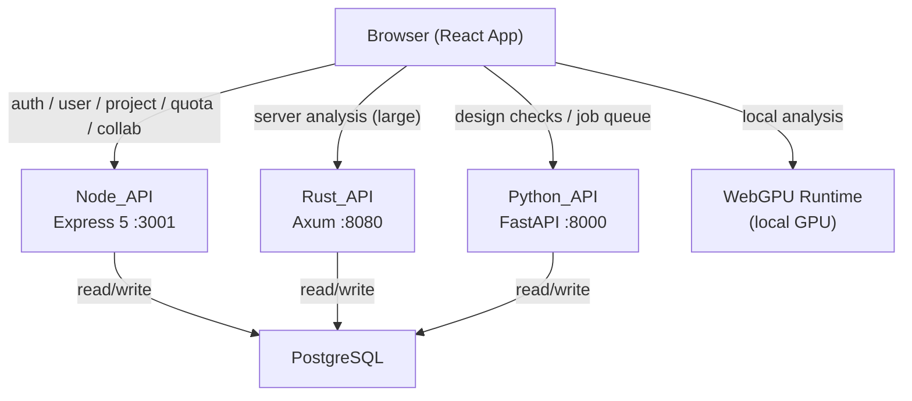
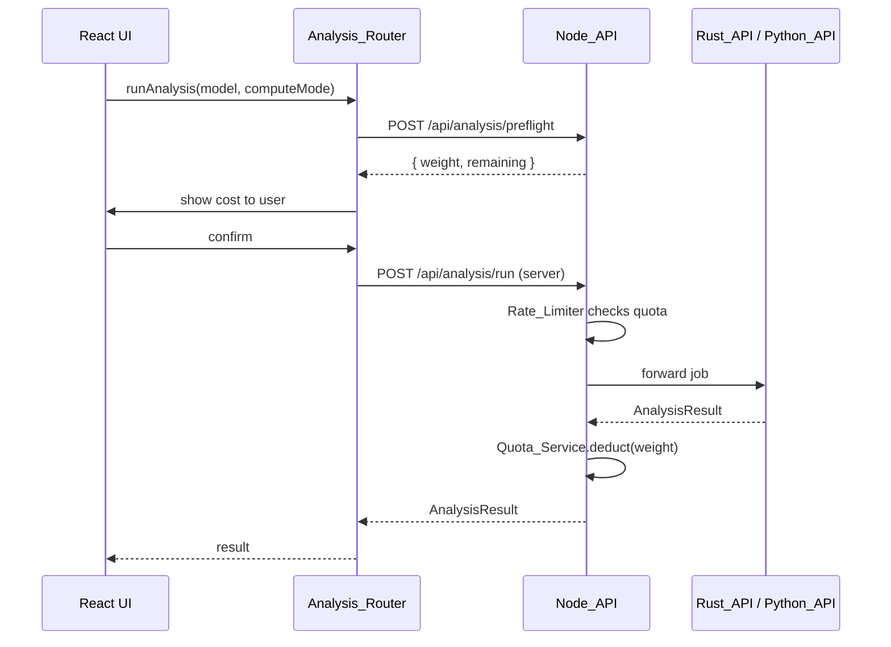
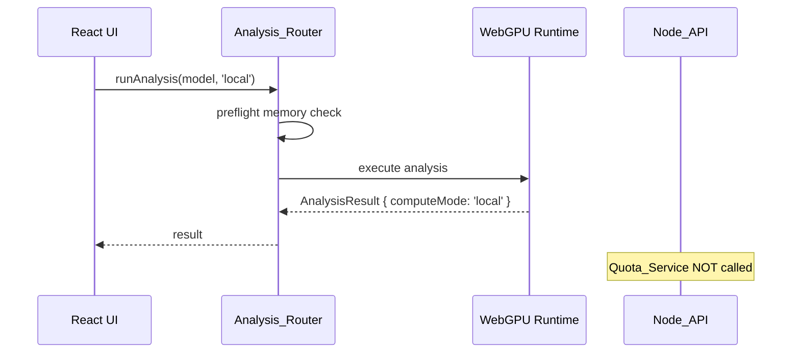

# Design Document: User Data Management and Platform

## Overview

BeamLab's user data management and platform layer is the backbone of the multi-tier SaaS product. It provides persistent user accounts and project state, enforces per-user daily quotas with compute-aware weighting, enables project collaboration, gates features by subscription tier, and integrates optional WebGPU local compute to offload analysis from the server.

The system is composed of three backend services and a React frontend:

- **Node_API** (Express 5, port 3001): authentication, user management, project CRUD, quota enforcement, billing, and collaboration.
- **Rust_API** (Axum, port 8080): medium-to-large structural analysis jobs routed from the frontend.
- **Python_API** (FastAPI, port 8000): design checks and job queuing.
- **React Frontend**: hosts the `Subscription_Provider` context, the `Analysis_Router` hook, and all adaptive UI components.

All quota enforcement and feature gating is authoritative on the server (Node_API). Client-side checks are optimistic UI only.

---

## Architecture



### Request Flow: Server Analysis



### Request Flow: Local (WebGPU) Analysis



---

## Components and Interfaces

### Node_API Endpoints

#### User & Auth

| Method | Path | Description |
|--------|------|-------------|
| POST | `/api/auth/register` | Create user account |
| POST | `/api/auth/login` | Authenticate, return JWT |
| GET | `/api/user/profile` | Return stored profile |
| GET | `/api/user/quota` | Return remaining quota + `localComputeAvailable` |

#### Projects

| Method | Path | Description |
|--------|------|-------------|
| POST | `/api/projects` | Create project (quota-gated) |
| GET | `/api/projects` | List user's projects |
| GET | `/api/projects/:id` | Get project + full state |
| PUT | `/api/projects/:id` | Save/update project state |
| DELETE | `/api/projects/:id` | Delete project |

#### Collaboration

| Method | Path | Description |
|--------|------|-------------|
| POST | `/api/projects/:id/collaborators` | Send invite by email |
| GET | `/api/projects/:id/collaborators` | List collaborators + status |
| PATCH | `/api/projects/:id/collaborators/:userId/accept` | Accept invite |
| DELETE | `/api/projects/:id/collaborators/:userId` | Revoke access |

#### Analysis

| Method | Path | Description |
|--------|------|-------------|
| POST | `/api/analysis/preflight` | Compute weight, return cost preview |
| POST | `/api/analysis/run` | Run server-side analysis (quota-gated) |

#### Subscription

| Method | Path | Description |
|--------|------|-------------|
| GET | `/api/subscription` | Return tier + feature flags |
| POST | `/api/subscription/upgrade` | Initiate tier change |

### Subscription_Provider (React Context)

```typescript
interface SubscriptionContext {
  tier: 'free' | 'pro' | 'enterprise';
  features: FeatureFlags;
  quota: QuotaStatus;
  webGpuAvailable:
 boolean;
  isLoading: boolean;
  canAccess: (feature: keyof FeatureFlags) => boolean;
  refreshTier: () => Promise<void>;
}

interface FeatureFlags {
  collaboration: boolean;
  pdfExport: boolean;
  aiAssistant: boolean;
  advancedDesignCodes: boolean;
  apiAccess: boolean;
}

interface QuotaStatus {
  projectsRemaining: number | null;   // null = unlimited
  computeUnitsRemaining: number | null;
  localComputeAvailable: boolean;
}
```

The provider initializes by fetching `/api/subscription` and `/api/user/quota`. While loading it serves the last cached tier from `localStorage` to prevent layout shift (Requirement 7.6). On tier change it re-fetches without requiring logout.

### Analysis_Router (React Hook)

```typescript
interface AnalysisRouterOptions {
  model: StructuralModel;
  preferredMode?: 'local' | 'server';
}

interface AnalysisResult {
  computeMode: 'local' | 'server';
  displacements: Float64Array;
  reactions: Float64Array;
  memberForces: Float64Array;
  status: 'success' | 'error';
  errorMessage?: string;
}

function useAnalysisRouter(): {
  runAnalysis: (opts: AnalysisRouterOptions) => Promise<AnalysisResult>;
  webGpuAvailable: boolean;
  preflightCost: (model: StructuralModel) => Promise<{ weight: number; remaining: number }>;
}
```

Detection logic runs once on mount via `navigator.gpu.requestAdapter()`. Result is stored in `Subscription_Provider` context and in a module-level cache so subsequent calls are synchronous.

### Rate_Limiter Middleware (Node_API)

```typescript
// Applied to quota-gated routes
async function rateLimiter(req, res, next) {
  const user = req.user;
  if (user.tier !== 'free') return next();          // Pro/Enterprise bypass
  const quota = await QuotaService.get(user.id);
  if (quota.projectsUsed >= TIER_CONFIG.free.maxProjectsPerDay) {
    return res.status(429).json({ message: `You have reached your limit of 3 projects for today.` });
  }
  next();
}
```

### Quota_Service

```typescript
interface QuotaService {
  get(userId: string): Promise<QuotaRecord>;
  deductComputeUnits(userId: string, weight: number): Promise<void>;
  incrementProjects(userId: string): Promise<void>;
  reset(userId: string): Promise<void>;           // called at UTC midnight
  computeWeight(nodeCount: number, memberCount: number): number;
}

// Weight formula (Requirement 4.1)
function computeWeight(nodeCount: number, memberCount: number): number {
  return Math.max(1, Math.ceil(nodeCount / 50) + Math.ceil(memberCount / 100));
}
```

---

## Data Models

### PostgreSQL Schema

```sql
-- Users
CREATE TABLE users (
  id            UUID PRIMARY KEY DEFAULT gen_random_uuid(),
  display_name  TEXT NOT NULL,
  email         TEXT UNIQUE NOT NULL,
  tier          TEXT NOT NULL DEFAULT 'free' CHECK (tier IN ('free','pro','enterprise')),
  created_at    TIMESTAMPTZ NOT NULL DEFAULT now()
);

-- Projects
CREATE TABLE projects (
  id            UUID PRIMARY KEY DEFAULT gen_random_uuid(),
  owner_id      UUID NOT NULL REFERENCES users(id) ON DELETE CASCADE,
  name          TEXT NOT NULL,
  created_at    TIMESTAMPTZ NOT NULL DEFAULT now(),
  updated_at    TIMESTAMPTZ NOT NULL DEFAULT now()
);

-- Project state (separate table to avoid loading large blobs on list queries)
CREATE TABLE project_states (
  project_id    UUID PRIMARY KEY REFERENCES projects(id) ON DELETE CASCADE,
  state_json    JSONB NOT NULL,
  saved_at      TIMESTAMPTZ NOT NULL DEFAULT now()
);

-- Daily quota records (one row per user per UTC date)
CREATE TABLE quota_records (
  id                  UUID PRIMARY KEY DEFAULT gen_random_uuid(),
  user_id             UUID NOT NULL REFERENCES users(id) ON DELETE CASCADE,
  window_date         DATE NOT NULL,                -- UTC date
  projects_created    INT NOT NULL DEFAULT 0,
  compute_units_used  INT NOT NULL DEFAULT 0,
  UNIQUE (user_id, window_date)
);

-- Collaboration invites
CREATE TABLE collaboration_invites (
  id            UUID PRIMARY KEY DEFAULT gen_random_uuid(),
  project_id    UUID NOT NULL REFERENCES projects(id) ON DELETE CASCADE,
  inviter_id    UUID NOT NULL REFERENCES users(id),
  invitee_id    UUID NOT NULL REFERENCES users(id),
  status        TEXT NOT NULL DEFAULT 'pending' CHECK (status IN ('pending','accepted','revoked')),
  access_level  TEXT NOT NULL DEFAULT 'write' CHECK (access_level IN ('read','write')),
  created_at    TIMESTAMPTZ NOT NULL DEFAULT now(),
  updated_at    TIMESTAMPTZ NOT NULL DEFAULT now(),
  UNIQUE (project_id, invitee_id)
);

-- Indexes
CREATE INDEX idx_projects_owner ON projects(owner_id);
CREATE INDEX idx_quota_user_date ON quota_records(user_id, window_date);
CREATE INDEX idx_collab_project ON collaboration_invites(project_id);
CREATE INDEX idx_collab_invitee ON collaboration_invites(invitee_id);
```

### Tier Config (server-side constant)

```typescript
const TIER_CONFIG = {
  free: {
    maxProjectsPerDay: 3,
    maxComputeUnitsPerDay: 5,
    collaboration: false,
    pdfExport: false,
    aiAssistant: false,
    advancedDesignCodes: false,
    apiAccess: false,
  },
  pro: {
    maxProjectsPerDay: Infinity,
    maxComputeUnitsPerDay: 100,
    collaboration: true,
    pdfExport: true,
    aiAssistant: true,
    advancedDesignCodes: true,
    apiAccess: false,
  },
  enterprise: {
    maxProjectsPerDay: Infinity,
    maxComputeUnitsPerDay: Infinity,
    collaboration: true,
    pdfExport: true,
    aiAssistant: true,
    advancedDesignCodes: true,
    apiAccess: true,
  },
} as const;
```

### AnalysisResult Interface

```typescript
interface AnalysisResult {
  jobId: string;
  computeMode: 'local' | 'server';
  displacements: number[];
  reactions: number[];
  memberForces: number[];
  computeUnitsCharged: number;   // 0 for local
  status: 'success' | 'error';
  errorMessage?: string;
}
```

---

## Correctness Properties

*A property is a characteristic or behavior that should hold true across all valid executions of a system — essentially, a formal statement about what the system should do. Properties serve as the bridge between human-readable specifications and machine-verifiable correctness guarantees.*

### Property 1: User Registration Round-Trip

*For any* valid registration payload (unique ID, display name, email), after a successful registration call, a subsequent profile fetch for that user ID should return the same display name and a non-null creation timestamp.

**Validates: Requirements 1.1, 1.2**

---

### Property 2: Duplicate Registration Rejected

*For any* user already present in the database, a second registration attempt with the same user ID should return HTTP 409, and the total user count in the database should remain unchanged.

**Validates: Requirements 1.3**

---

### Property 3: Foreign Key Association Invariant

*For any* project, collaboration invite, or quota record created by a user, the `user_id` (or `owner_id`) field on that record should equal the creating user's ID.

**Validates: Requirements 1.4**

---

### Property 4: Project State Round-Trip for Any Authorized Accessor

*For any* project state (including geometry, loads, boundary conditions, and analysis results) saved by an owner or collaborator, a subsequent GET request by the owner or any accepted collaborator should return a state that is deeply equal to the saved state.

**Validates: Requirements 2.1, 2.6, 5.3, 5.7**

---

### Property 5: updatedAt Advances on Save

*For any* project save operation, the `updatedAt` timestamp returned in the response should be greater than or equal to the `updatedAt` value recorded before the save was initiated.

**Validates: Requirements 2.4**

---

### Property 6: Quota Tracking Accuracy

*For any* free-tier user who performs a sequence of project creations and server-side analysis jobs with known weights, the `GET /api/user/quota` response should report `computeUnitsRemaining` equal to `(dailyLimit - sum(weights))` and `projectsRemaining` equal to `(dailyLimit - projectsCreated)`.

**Validates: Requirements 3.1, 3.6, 4.2, 9.2**

---

### Property 7: Quota Enforcement Rejects at Limit

*For any* free-tier user whose current Daily_Window usage has reached or exceeded the tier limit (3 projects or 5 compute units), any further project creation or analysis request should be rejected with HTTP 429, and the quota counters should remain unchanged after the rejection.

**Validates: Requirements 3.2, 3.3, 4.3**

---

### Property 8: Pro and Enterprise Users Bypass Quota

*For any* Pro or Enterprise user, regardless of how many projects they have created or how many compute units they have consumed in the current Daily_Window, the Rate_Limiter should permit project creation and analysis requests without returning HTTP 429.

**Validates: Requirements 3.7**

---

### Property 9: Compute Weight Formula Consistency

*For any* (nodeCount, memberCount) pair, the weight computed by `Quota_Service.computeWeight(nodeCount, memberCount)` should equal `Math.max(1, Math.ceil(nodeCount / 50) + Math.ceil(memberCount / 100))`, and the weight returned in the preflight response for a model with those dimensions should equal the same value.

**Validates: Requirements 4.1, 4.4**

---

### Property 10: Local Compute Does Not Consume Server Quota

*For any* user who runs an analysis job with `computeMode: 'local'`, the user's `computeUnitsRemaining` value returned by `GET /api/user/quota` should be identical before and after the job completes.

**Validates: Requirements 4.5, 9.1**

---

### Property 11: Collaboration Access Control

*For any* project and any user who has been sent a collaboration invite, after the invite is accepted that user should receive HTTP 200 on GET requests for the project; after the owner revokes the invite, that same user should receive HTTP 403 on subsequent GET requests for the project.

**Validates: Requirements 5.2, 5.4**

---

### Property 12: Only Owner Can Manage Invites

*For any* project and any user who is not the project owner, attempts to POST, PATCH, or DELETE collaboration invites for that project should be rejected with HTTP 403.

**Validates: Requirements 5.6**

---

### Property 13: Invite to Unknown Email Returns 404

*For any* email address that does not correspond to a registered user, a collaboration invite POST to that address should return HTTP 404 and no invite record should be created in the database.

**Validates: Requirements 5.5**

---

### Property 14: Feature Gating Enforced Server-Side

*For any* (tier, feature) pair where `TIER_CONFIG[tier][feature] === false`, a server-side API request for that feature made by a user of that tier should be rejected with HTTP 403, regardless of any client-side tier claims in the request.

**Validates: Requirements 6.2, 6.5**

---

### Property 15: Analysis Routing by Compute Mode

*For any* analysis job with `computeMode: 'local'`, the Analysis_Router should not make any HTTP request to the Rust_API or Python_API; for any job with `computeMode: 'server'`, the Analysis_Router should make exactly one HTTP request to the appropriate backend.

**Validates: Requirements 8.3, 8.4**

---

### Property 16: Memory Preflight Warns When Over GPU Limit

*For any* structural model whose estimated memory footprint exceeds the GPU adapter's reported available memory, the Analysis_Router's preflight check should return a warning result and should not proceed to execute the local analysis without user confirmation.

**Validates: Requirements 8.6, 8.7**

---

### Property 17: Local Analysis Result Has Correct Compute Mode

*For any* analysis job that completes successfully via the WebGPU_Runtime, the returned `AnalysisResult` object should have `computeMode === 'local'` and `computeUnitsCharged === 0`.

**Validates: Requirements 8.8, 9.1**

---

## Error Handling

### Node_API Error Responses

All error responses follow a consistent envelope:

```json
{
  "error": {
    "code": "QUOTA_EXCEEDED",
    "message": "You have exhausted your 5 analyses for today.",
    "details": {
      "jobWeight": 3,
      "remaining": 2
    }
  }
}
```

| Scenario | HTTP Status | Error Code |
|----------|-------------|------------|
| Duplicate user registration | 409 | `USER_ALREADY_EXISTS` |
| Project quota exceeded | 429 | `PROJECT_QUOTA_EXCEEDED` |
| Compute unit quota exceeded | 429 | `COMPUTE_QUOTA_EXCEEDED` |
| Feature not in tier | 403 | `FEATURE_NOT_IN_TIER` |
| Invite to unknown email | 404 | `USER_NOT_FOUND` |
| Non-owner managing invites | 403 | `FORBIDDEN` |
| Revoked collaborator access | 403 | `ACCESS_REVOKED` |
| Invalid JWT / unauthenticated | 401 | `UNAUTHORIZED` |

### Client-Side Error Handling

- **Network failure during save**: State is written to `localStorage` under key `beamlab:unsaved:{projectId}`. A retry loop with exponential backoff (1s, 2s, 4s, max 30s) attempts to flush on reconnect.
- **WebGPU runtime error**: `Analysis_Router` catches the error, sets `status: 'error'` on the result, and surfaces a modal offering server fallback.
- **Quota exhausted with WebGPU available**: UI displays a banner pointing the user to switch to local compute mode.

### Quota Reset

A scheduled job (cron `0 0 * * *` UTC) calls `QuotaService.resetAll()` which issues:

```sql
UPDATE quota_records
SET projects_created = 0, compute_units_used = 0
WHERE window_date < CURRENT_DATE;
```

New rows are created on first use each day via `INSERT ... ON CONFLICT DO UPDATE`.

---

## Testing Strategy

### Dual Testing Approach

Both unit tests and property-based tests are required. They are complementary:

- **Unit tests** cover specific examples, integration points, and edge cases.
- **Property-based tests** verify universal correctness across randomly generated inputs.

### Property-Based Testing

The property-based testing library for this project is **fast-check** (TypeScript/JavaScript). Each property test runs a minimum of **100 iterations**.

Each test must include a comment tag in the format:
`// Feature: user-data-management-and-platform, Property N: <property_text>`

Each correctness property defined above must be implemented by exactly one property-based test.

Example skeleton:

```typescript
import fc from 'fast-check';

// Feature: user-data-management-and-platform, Property 9: Compute weight formula consistency
test('computeWeight matches formula for all node/member counts', () => {
  fc.assert(
    fc.property(
      fc.integer({ min: 0, max: 10000 }),
      fc.integer({ min: 0, max: 10000 }),
      (nodeCount, memberCount) => {
        const expected = Math.max(1, Math.ceil(nodeCount / 50) + Math.ceil(memberCount / 100));
        expect(computeWeight(nodeCount, memberCount)).toBe(expected);
      }
    ),
    { numRuns: 100 }
  );
});
```

### Unit Tests

Unit tests should focus on:

- Specific HTTP response shapes (status codes, body fields) for each endpoint
- Edge cases: zero nodes/members (weight = 1), exactly-at-limit quota, empty project state
- Integration between Rate_Limiter middleware and Quota_Service
- `Subscription_Provider` renders cached tier during loading state
- `Analysis_Router` WebGPU detection with mocked `navigator.gpu`
- Collaboration invite lifecycle: pending → accepted → revoked

### Test Coverage Targets

| Area | Unit Tests | Property Tests |
|------|-----------|----------------|
| Quota_Service.computeWeight | edge cases (0,0), (1,1), (50,100) | Property 9 |
| Rate_Limiter | at-limit, over-limit, pro bypass | Properties 7, 8 |
| Project state persistence | save/load round-trip example | Property 4 |
| Collaboration access | accept/revoke lifecycle | Properties 11, 12, 13 |
| Feature gating | each tier × each feature | Property 14 |
| Analysis_Router routing | local vs server dispatch | Property 15 |
| WebGPU memory preflight | under/over GPU memory | Property 16 |
| Quota exemption (local) | local job, check counter | Property 10 |
