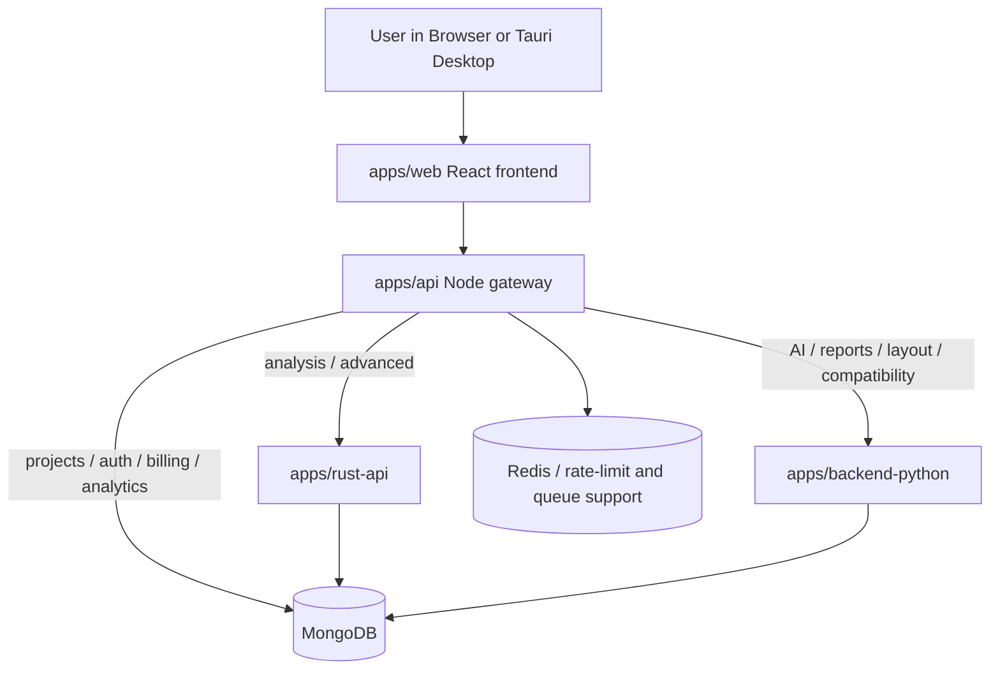
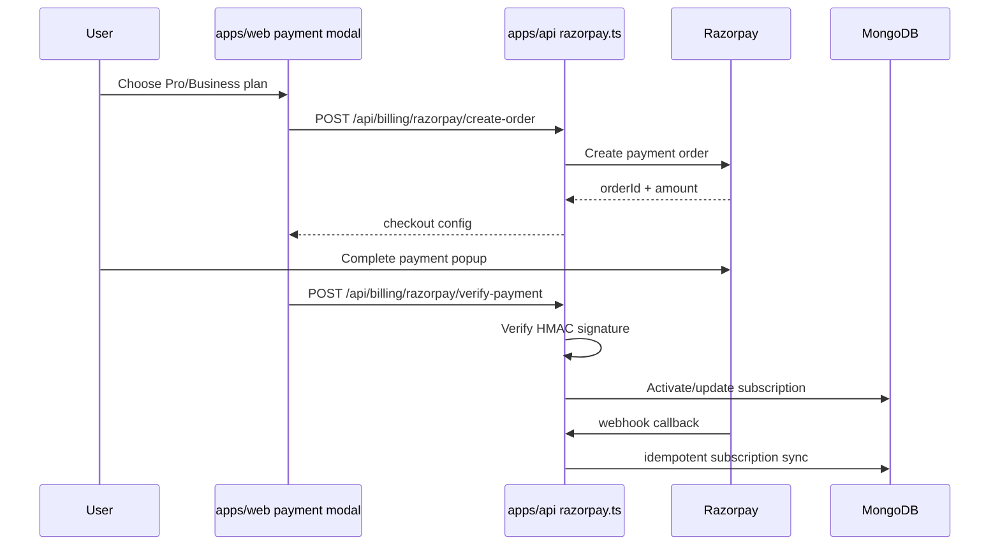

# BeamLab System Design Document

Last updated: 2026-04-01
Scope: Repository-wide architecture baseline for implementation and AI-assisted changes.

## 1. Executive Summary

BeamLab is a multi-runtime engineering platform with three main execution lanes:

1. Browser lane: React + TypeScript + WASM (for immediate/local analysis and interactive engineering UI).
2. Gateway lane: Node/Express API (`apps/api`) for auth, rate-limits, quota, validation, and backend orchestration.
3. Compute lane: Rust API (`apps/rust-api`) as canonical high-performance structural solver and design-code execution engine.

A second Rust crate (`apps/backend-rust`) is packaged for WASM/browser and worker use, while `packages/math-utils` provides shared Rust numerical utilities consumed by both Rust crates.

## 2. Project Structure and Runtime Roles

### 2.1 Core Components

- `apps/web`:
        React frontend, route composition, UI system, client validation, API clients, and WASM integration (`backend-rust` and `solver-wasm`).
- `apps/api`:
        Node gateway layer. Enforces auth, quotas, request validation, backpressure/rate limits, service trust, and proxy contracts before forwarding to Rust/Python services.
- `apps/rust-api`:
        Axum HTTP service and canonical server-side structural analysis + design code execution.
- `apps/backend-rust`:
        Rust crate exported as JS/WASM package (`pkg/backend_rust.js`) used directly in frontend workers/services for local compute.
- `packages/math-utils`:
        Shared Rust library crate (`math-utils`) with domain math helpers (for example concrete, seismic interpolation, graph ordering).

### 2.2 `apps/rust-api` vs `apps/backend-rust` vs `packages/math-utils`

- `apps/rust-api`:
        Networked service crate. Owns HTTP handlers, auth middleware, persistence hooks, API contracts, and production server runtime.
- `apps/backend-rust`:
        Browser/worker-oriented compute crate. Built via `wasm-pack` and imported from frontend (`import "backend-rust"`).
- `packages/math-utils`:
        Dependency-only crate with reusable pure math/domain logic. No HTTP/server responsibilities.

Dependency direction observed in manifests:

- `apps/rust-api/Cargo.toml` depends on `math-utils` via path.
- `apps/backend-rust/Cargo.toml` depends on `math-utils` via path.
- Frontend `apps/web/package.json` depends on `backend-rust` (workspace package) and `solver-wasm`.

## 3. Crate Boundaries (Authoritative Rules)

These are mandatory architecture rules for future implementation.

### Rule A: Ownership by Runtime Context

- `apps/rust-api` owns server-side API behavior, request/response models, HTTP route composition, gateway-facing contracts, and production solver execution.
- `apps/backend-rust` owns browser/worker WASM exports and client-local compute helpers.
- `packages/math-utils` owns runtime-agnostic mathematical primitives only.

### Rule B: No HTTP in Shared or WASM Utility Crates

- `packages/math-utils` must remain pure computation (no Axum, no web server concerns, no persistence).
- `apps/backend-rust` should not absorb Node gateway logic, auth policy, or API orchestration concerns.

### Rule C: Shared Math Must Flow Inward, Not Sideways

- Reusable equations/algorithms should move into `packages/math-utils` when they are runtime-agnostic.
- `apps/rust-api` and `apps/backend-rust` may depend on `packages/math-utils`; they must not depend on each other directly.

### Rule D: API Contract and Gateway Responsibilities Stay Outside Solver Crates

- `apps/api` performs external-facing request hardening and policy enforcement (auth, quotas, backpressure, tenant/device controls).
- `apps/rust-api` validates solver feasibility/physics constraints and computes results.

### Rule E: Frontend Entry is Through Stable Clients/Services

- UI components should not call low-level solver exports directly when canonical service wrappers already exist (`rustApi`, `analysisService`, `wasmSolverService`).

### Rule F: Do Not Duplicate Core Domain Equations Across Crates Without Intent

- If the same validated formula is needed in both server and WASM, prefer extraction to `packages/math-utils`.
- Duplication is allowed only with explicit reason (performance, serialization shape, or deliberate divergence).

## 4. State Flow: User Action Lifecycle

The requested flow involving `MasterDataGrid` and `MemberDesignTemplate` is represented as two practical paths.

### 4.1 Path A: Template + Grid Interaction (Current UI Scaffold Path)

1. User edits engineering table values through `MasterDataGrid` (`apps/web/src/components/MasterDataGrid.tsx` or `apps/web/src/components/ui/MasterDataGrid.tsx`).
2. `MemberDesignTemplate` holds local state (`input`, `result`, `error`) and computes `validationError` from `config.validate`.
3. On Analyze click, `handleAnalyze()` re-validates and currently sets a local mock result (`setResult({ memberType, input, status: 'ok' })`).
4. No backend call occurs in this template path today.

Important: `MemberDesignTemplate` exists as a reusable shell and is not currently mounted via route usage in `apps/web`.

### 4.2 Path B: Active Production Analysis Flow to Rust Solver

1. User triggers analysis from authenticated design/modeling workflow (hook stack uses `useAnalysisExecution`, `analysisService`, `rustApi`).
2. Frontend assembles model payload and routing decision (`wasm`, `worker`, or `cloud`).
3. For cloud/server path, frontend calls `rustApi.smartAnalyze` or `rustApi.submitJob`.
4. Requests go to either:
         - Node gateway (`apps/api`) endpoints such as `/api/analyze` and `/api/analysis/*` (proxy path), or
         - Direct Rust URL (when frontend client is configured to hit `API_CONFIG.rustUrl` for specific endpoints).
5. In gateway path, `apps/api` applies middleware pipeline:
         - Auth, rate limits, cost weighting, backpressure.
         - Zod body validation (`analyzeRequestSchema`).
         - Device/session checks, quota/model size guards, caching policy.
         - Proxy forwarding via `rustProxy` in `serviceProxy.ts` with timeout/retry/circuit breaker.
6. `apps/rust-api` receives normalized payload at `/api/analyze` or `/api/analysis/*` handlers.
7. Rust handlers do input sanity checks (for example non-empty nodes/members/supports, model size bounds), then execute solver modules (`solver::Solver`, modal/time-history/seismic solvers).
8. Response returns through gateway (contract assertion) to frontend.
9. Frontend updates stores, progress UI, and reports/results surfaces.

### 4.3 Sequence Snapshot

- UI intent: `MasterDataGrid` edits + run action
- Client validation: template/schema checks
- Gateway policy: auth + Zod + quotas + backpressure + proxy contract
- Rust compute: solver + advanced analysis
- Return path: typed/validated response handling in frontend

## 5. Data Integrity and Validation Strategy

BeamLab uses layered validation with deliberate redundancy.

### Layer 1: Frontend Validation (TypeScript + Zod + component constraints)

- Generic and domain schemas in `apps/web/src/lib/validation.ts` and utility validators.
- API response validation schemas in `apps/web/src/lib/api/responseSchemas.ts` to detect schema drift.
- Grid-level constraints in `MasterDataGrid` (`required`, bounds, regex, custom validation fields).
- Feature-level hooks use safe parsing and error formatting for UX-safe failures.

Primary goal: prevent invalid payload construction and detect incompatible backend responses early.

### Layer 2: Node Gateway Validation (Zod Runtime Contracts)

- `apps/api/src/middleware/validation.ts` defines `analyzeRequestSchema` and many domain schemas.
- `validateBody` middleware enforces request shape and coercion before handler logic.
- Cross-field checks via `superRefine`:
        - Node/member reference integrity.
        - Member-group/property-assignment membership validity.
        - Domain rules (for example wind + seismic exclusion in combinations).

Primary goal: reject malformed or policy-breaking requests before they touch compute services.

### Layer 3: Rust API Data Integrity (Serde + explicit domain guards)

- Strong typed deserialization via `serde` structs in solver/handler models.
- Defaults via `#[serde(default)]` and renamed compatibility fields to absorb format variants.
- Explicit runtime checks in handlers and solver code (for example non-empty sets, dimensions, supports, limits).

Primary goal: enforce computational preconditions and maintain solver stability.

### Layer 4: Proxy Contract Integrity

- Gateway asserts upstream payload shape (`assertAnalysisPayload`, other proxy contract guards).
- Prevents unsafe pass-through of malformed upstream responses.

Primary goal: preserve response contract invariants for frontend consumers.

## 6. Website Design System Philosophy

BeamLab follows a configuration-first, systemized UI approach to avoid brittle hardcoded screens.

### 6.1 Tailwind + Tokenized Theme Architecture

- Tailwind v4 with modular CSS imports (`index.css` importing `base/components/animations/utilities`).
- Global design tokens defined via `@theme` in `styles/base.css` (colors, typography, elevation, radii, motion, dark-mode contract).
- Utility helper `cn()` (`clsx` + `tailwind-merge`) standardizes class composition.

Principle: visual consistency comes from tokens and primitives, not per-page ad-hoc styling.

### 6.2 Headless UI Composition

- Radix primitives (`@radix-ui/*`) used with custom wrappers (for example button, dialogs, selects) and CVA variants.
- Components expose variants, sizes, loading/icon states, and accessibility semantics while keeping behavior composable.

Principle: behavior from headless primitives, identity from BeamLab tokens and variant system.

### 6.3 Configuration-Driven Screens and Data Surfaces

- Route metadata and feature catalogs in `config/appRouteMeta.ts` and route composition modules.
- Grid behavior driven by config objects (`MasterGridConfig`, `MasterDataGridConfig`) instead of bespoke tables.
- Report and workflow UIs use registries/config maps (`reportGridConfigs.ts`, route redirect maps, workflow targets).

Principle: describe pages/features declaratively; render from metadata/config so AI and developers can extend safely.

### 6.4 Avoiding Hardcoded Pages

Patterns used to reduce hardcoding:

- Centralized route metadata and feature categories.
- Reusable templates (for example `MemberDesignTemplate`) with injected schema/validation/config.
- Generic data-grid component accepting column schema, validation, formatting, and action registries.
- Service abstraction (`rustApi`, `analysisService`, `wasmSolverService`) decoupling UI from transport details.

## 7. Canonical API/Compute Responsibilities

- Browser local compute: `backend-rust`/`solver-wasm` via `wasmSolverService` and workers.
- Gateway policy and orchestration: `apps/api`.
- Authoritative server compute + design code engines: `apps/rust-api`.
- Shared computational kernels: `packages/math-utils`.

## 8. Known Architecture Nuances (Important for AI Suggestions)

1. `MemberDesignTemplate` is currently a scaffold path; production analysis pipelines route through `useAnalysisExecution` + service clients.
2. Frontend can operate in hybrid mode (WASM local, worker, or cloud backend) based on model size and user intent.
3. Node gateway is intentionally a thin proxy for solver logic but a thick policy layer (auth, quota, validation, resilience).
4. Rust API and backend-rust both consume `math-utils`; keep shared equations there when runtime-agnostic.

## 9. AI Contribution Guardrails

When generating future code suggestions, enforce:

1. Respect crate boundaries in Section 3.
2. Add/modify validation in all required layers, not only one.
3. Prefer config/registry extension over route/page copy-paste.
4. Keep API contracts stable; if changed, update gateway contract assertions and frontend response schemas together.
5. For solver/domain math shared across server and WASM, prefer extraction to `packages/math-utils`.

## 10. Future Refactoring Opportunities

1. Wire `MemberDesignTemplate` to production design-analysis endpoints when design workflow finalization is prioritized.
2. Consolidate duplicate grid implementations (`components/MasterDataGrid.tsx` and `components/ui/MasterDataGrid.tsx`) behind a single canonical API.
3. Expand contract tests that exercise frontend response schemas against real Rust gateway payload samples.
4. Increase extraction of duplicated formulas to `packages/math-utils` where semantics are identical.

## 11. Mandatory Coding Standards (System Design Rules)

1. Domain ownership first:
        Keep engineering equations, solver kernels, and design-code math in domain modules, not handlers. Handlers only orchestrate (parse, guard, call, map response).
2. DRY extraction to `math-utils`:
        Move logic to `packages/math-utils` only when it is pure computation, reusable across at least two modules/runtimes, and has stable typed inputs/outputs.
3. No utility sinkholes:
        Do not add vague `common` helpers. Extract by engineering domain (`concrete`, `seismic`, `ordering`, etc.) with explicit ownership.
4. Crate boundary rule:
        `math-utils` must stay runtime-agnostic (no HTTP/auth/DB concerns). Gateway policy stays in `apps/api`, server compute stays in `apps/rust-api`.
5. Trait-first backend genericity:
        Use Rust traits (for example `StructuralElement`) to encode generic behavior across member types. Prefer polymorphism over handler-level type branching.
6. Strong trait contracts:
        Trait methods must return typed engineering outputs (capacity, compliance, stiffness/check results) with clause/safety context, not loose maps.
7. Frontend template mandate:
        For structurally similar member workflows, use `MemberDesignTemplate` + schema/config injection instead of creating a new `.tsx` page per member.
8. Schema-driven UI:
        New member input forms must be defined through `apps/web/src/config/design-schemas/index.ts`; avoid hardcoded field logic inside page components.
9. Validation layering is required:
        Maintain all layers: frontend schema checks, gateway request validation, Rust typed deserialization + physics guards, and proxy contract assertions.
10. Sparse-first performance standard:
         Assemble and solve global systems using sparse structures (`CooMatrix`/`CsrMatrix`) by default; dense conversion is exception-only and documented.
11. Nalgebra usage standard:
         Use fixed-size nalgebra types for local element math and nalgebra-sparse for assembled global systems; avoid repeated dense reallocations in hot paths.
12. Performance change gate:
         Any solver-path optimization must include benchmark evidence (before/after latency or memory) and preserve deterministic fallback behavior.

### Request and ownership flow



### Monorepo layout

Workspace composition is defined by [`pnpm-workspace.yaml`](../pnpm-workspace.yaml), which includes:

- `apps/*`
- `packages/*`

Primary runtime apps:

- [`../apps/web`](../apps/web) — React/Vite product frontend
- [`../apps/api`](../apps/api) — Express-based gateway, auth, CRUD, billing, analytics, orchestration
- [`../apps/rust-api`](../apps/rust-api) — Axum/Tokio/Rayon structural analysis and design service
- [`../apps/backend-python`](../apps/backend-python) — FastAPI-based analysis, AI, sections, reports, layout, compatibility service
- [`../apps/desktop`](../apps/desktop) — Tauri shell wrapping the web app for desktop distribution

Shared packages:

- [`../packages/analysis`](../packages/analysis)
- [`../packages/database`](../packages/database)
- [`../packages/solver`](../packages/solver)
- [`../packages/solver-wasm`](../packages/solver-wasm)

## 2. Runtime architecture and service boundaries

### Web frontend: `apps/web`

The frontend is a React 18 + TypeScript single-page application with lazy-loaded route modules, auth-aware layout composition, API client utilities, domain-specific pages, and a large structural feature set.

Key entry files:

- [`../apps/web/src/main.tsx`](../apps/web/src/main.tsx)
- [`../apps/web/src/App.tsx`](../apps/web/src/App.tsx)
- [`../apps/web/src/config/appRouteMeta.ts`](../apps/web/src/config/appRouteMeta.ts)

Key responsibilities:

- Marketing and public pages (`/`, `/pricing`, legal/help)
- Authenticated dashboard and project workspace (`/stream`, `/app`)
- Structural analysis UI (`/analysis/*`)
- Structural design UI (`/design/*`)
- Reporting and export UI (`/reports*`)
- Enterprise/collaboration/integration dashboards
- Pricing, subscription, AI, civil, room-planning, and learning features

### Node gateway/API: `apps/api`

The Node service is the web-facing orchestration layer. It is **not the primary structural solver**.

Key entry file:

- [`../apps/api/src/index.ts`](../apps/api/src/index.ts)

Key responsibilities:

- Auth bootstrapping and protection (`@clerk/express` or in-house JWT fallback)
- Security middleware: CORS, Helmet, CSRF, request IDs, rate limiting, backpressure, XSS sanitization
- User/project/session/consent/usage/audit CRUD
- Billing and payment integration routes
- Analytics ingestion
- Socket-based collaboration/user presence coordination
- Proxying / routing frontend requests to Rust or Python services through route modules

### Rust structural API: `apps/rust-api`

The Rust service is the primary high-performance compute layer for analysis/design workloads.

Key entry file:

- [`../apps/rust-api/src/main.rs`](../apps/rust-api/src/main.rs)

Key responsibilities:

- Linear and advanced structural analysis
- Design code endpoints (IS, ACI, AISC, EC, NDS, serviceability)
- Optimization flows and section auto-selection
- Fast structure CRUD for solver-owned data models
- Section/template endpoints
- Report generation endpoints for analysis/design calculations
- Shared analysis cache and performance-oriented runtime tuning

### Python backend: `apps/backend-python`

The Python service is the flexible engineering/AI/report layer. It overlaps with Rust in some engineering areas, but also owns AI-heavy and report-heavy capabilities.

Key entry file:

- [`../apps/backend-python/main.py`](../apps/backend-python/main.py)

Key responsibilities:

- Additional analysis and meshing endpoints
- Design, IS-code, and section routes
- Reports and document generation
- AI endpoints, layout generation, internal orchestration helpers
- Job routes and auxiliary collaboration/websocket routes
- Dependency health checks against Node and Rust services

### Desktop shell: `apps/desktop`

The desktop app is a Tauri shell over the web frontend, not a separate product architecture.

Key file:

- [`../apps/desktop/tauri.conf.json`](../apps/desktop/tauri.conf.json)

Desktop behavior today:

- Runs the web dev server during desktop development: `cd ../web && pnpm dev`
- Bundles the web build output for desktop packaging: `../web/dist`
- Uses Tauri as the native wrapper and installer/bundling layer

## 3. Frontend architecture (`apps/web`)

### 3.1 Entry and route composition

The application shell is built in [`../apps/web/src/App.tsx`](../apps/web/src/App.tsx). Important architectural patterns there:

- Route-level lazy loading via `React.lazy`
- `RequireAuth` wrapping for protected pages
- `ConditionalLayout` deciding whether to render `AppShell` or plain content
- Public route detection through `isPublicRoute()`
- Full-screen workspace handling through `isFullScreenRoute()`
- Route aliases for legacy paths
- Global providers and utilities including analytics, offline banner, cookie consent, and error boundaries

The route map is broad and divided across feature areas:

- Public marketing and auth pages
- Workspace/modeling pages
- Analysis pages (`/analysis/*`)
- Design pages (`/design/*`)
- Tools/utilities (`/tools/*`)
- Reports and visualization
- Civil engineering modules
- AI dashboards
- Enterprise/collaboration/integration pages

### 3.2 Navigation and route metadata

[`../apps/web/src/config/appRouteMeta.ts`](../apps/web/src/config/appRouteMeta.ts) is the route taxonomy file. It defines:

- `PUBLIC_PATHS`
- `FULL_SCREEN_PATHS`
- `APP_FEATURE_CATEGORIES`
- feature search items, labels, breadcrumbs, and category hierarchy

This file is effectively the frontend’s feature catalog and is central to:

- sidebar/navigation composition
- breadcrumb generation
- search/command palette discoverability
- classifying the app by domains such as analysis, design, tools, enterprise, reports, civil, AI, and learning

### 3.3 State, services, and composition

Key frontend architectural areas:

- [`../apps/web/src/providers`](../apps/web/src/providers) — auth, analytics, toast, cross-cutting providers
- [`../apps/web/src/store`](../apps/web/src/store) — Zustand-powered application state and persistence helpers
- [`../apps/web/src/services`](../apps/web/src/services) — business/service orchestration
- [`../apps/web/src/lib`](../apps/web/src/lib) and [`../apps/web/src/api`](../apps/web/src/api) — API client and helper layers
- [`../apps/web/src/hooks`](../apps/web/src/hooks) — custom behavior hooks for registration, device sessions, AI orchestration, analysis jobs, structural modeling, etc.
- [`../apps/web/src/components`](../apps/web/src/components) and [`../apps/web/src/pages`](../apps/web/src/pages) — UI shells and route entrypoints

### 3.4 Exact frontend integration touchpoints

The following files are the highest-value entrypoints for understanding how the frontend actually works:

| Concern | Verified file | What it does |
|---|---|---|
| app-wide route registry | [`../apps/web/src/App.tsx`](../apps/web/src/App.tsx) | Declares routes, auth wrappers, lazy-loading, shell/full-screen behavior |
| auth provider | [`../apps/web/src/providers/AuthProvider.tsx`](../apps/web/src/providers/AuthProvider.tsx) | Wraps Clerk, exposes unified auth context, token retrieval, sign-out cleanup |
| main model state | [`../apps/web/src/store/model.ts`](../apps/web/src/store/model.ts) | Core Zustand store for nodes, members, loads, combinations, analysis results, geometry tools, clipboard, modal results |
| analysis orchestration | [`../apps/web/src/services/AnalysisService.ts`](../apps/web/src/services/AnalysisService.ts) | Smart solver routing between local worker and cloud APIs, validation, polling, nonlinear requests |
| pricing config | [`../apps/web/src/config/pricing.ts`](../apps/web/src/config/pricing.ts) | Plan definitions, INR pricing, checkout plan IDs, feature bundles |
| payment entry modal | [`../apps/web/src/components/PaymentGatewaySelector.tsx`](../apps/web/src/components/PaymentGatewaySelector.tsx) | Selects Razorpay vs PhonePe and launches the chosen payment modal |
| professional report UI | [`../apps/web/src/pages/ProfessionalReportGenerator.tsx`](../apps/web/src/pages/ProfessionalReportGenerator.tsx) | Configures enterprise-style report sections and exports HTML-style report output |
| report builder engine | [`../apps/web/src/modules/reports/EngineeringReportGenerator.ts`](../apps/web/src/modules/reports/EngineeringReportGenerator.ts) | Structured report builder with sections, tables, equations, calculations, and specialized report generators |

### 3.5 User-facing feature chapters

The frontend is best understood in chapters:

1. **Public/marketing** — landing, pricing, help, legal, contact, capabilities
2. **Auth and user identity** — sign-in/sign-up, verification, locked/expired flows
3. **Dashboard and workspace** — `/stream`, `/app`, `/workspace/:moduleType`
4. **Analysis** — modal, time-history, seismic, buckling, p-delta, nonlinear, dynamic, pushover, plate-shell, optimization
5. **Design** — RC, foundation, steel, connections, reinforcement, detailing, composite, timber, design center, post-analysis hub
6. **Tools** — load combinations, section database, BBS, meshing, print/export, space planning, room planner
7. **Reports and visualization** — reports, report builder, professional reports, 3D engine, result animation
8. **Enterprise/integration** — collaboration, BIM, CAD, API dashboard, materials database, compliance
9. **AI** — AI dashboard and AI power interfaces
10. **Civil modules** — hydraulics, transportation, construction, quantity survey

For the route-level breakdown, see [`FRONTEND_ROUTE_AND_FEATURE_MAP.md`](./FRONTEND_ROUTE_AND_FEATURE_MAP.md).

### 3.6 Example frontend integration chains

#### Structural analysis flow

```text
/app or /analysis/* route
→ React page/panel in App.tsx
→ Zustand model state in store/model.ts
→ AnalysisService.ts
→ Node gateway /api/analyze or /api/advanced
→ Rust API primary solver endpoints
→ results returned to frontend state and visualization/report modules
```

#### Pricing and payment flow

```text
/pricing
→ EnhancedPricingPage.tsx
→ pricing config in config/pricing.ts
→ PaymentGatewaySelector.tsx
→ RazorpayPayment or PhonePePayment modal
→ Node billing endpoints under /api/billing/*
→ subscription state persisted in backend user/subscription models
```

#### Report flow

```text
/reports, /reports/builder, /reports/professional
→ report page component
→ EngineeringReportGenerator.ts and/or page-local report composition
→ backend report endpoints (Python and/or Rust)
→ exported engineering document shown, downloaded, or printed
```

## 4. User, auth, and session integration

### 4.1 Auth model

The frontend reads auth state through [`../apps/web/src/providers/AuthProvider.tsx`](../apps/web/src/providers/AuthProvider.tsx) and uses `RequireAuth` to guard protected routes.

On the backend, auth can be provided in two modes in [`../apps/api/src/index.ts`](../apps/api/src/index.ts):

- **Clerk mode** via `clerkMiddleware()`
- **In-house JWT mode** via `authMiddleware` and route-local `requireAuth()`

This means the user model is hybrid-capable:

- hosted identity provider support for production flows
- fallback/local auth support for self-managed or non-Clerk deployments

### 4.2 Session, user registration, and device lifecycle

In `App.tsx`, the frontend initializes:

- `useUserRegistration()`
- `useDeviceSession()`
- `useGlobalErrorHandler()`

These hooks indicate that user creation, device/session lifecycle, and global runtime error capture are frontend boot concerns rather than isolated page-level concerns.

Node route groups supporting this include:

- [`../apps/api/src/routes/authRoutes.ts`](../apps/api/src/routes/authRoutes.ts)
- [`../apps/api/src/routes/userRoutes.ts`](../apps/api/src/routes/userRoutes.ts)
- [`../apps/api/src/routes/sessionRoutes.ts`](../apps/api/src/routes/sessionRoutes.ts)
- [`../apps/api/src/routes/usageRoutes.ts`](../apps/api/src/routes/usageRoutes.ts)

### 4.3 Feature gating and pricing

Pricing is exposed publicly through `/pricing`, implemented by [`../apps/web/src/pages/EnhancedPricingPage.tsx`](../apps/web/src/pages/EnhancedPricingPage.tsx).

Gating signals exist across:

- frontend pricing/config modules
- auth tier logic in Node user/session models
- billing routes in Node

The architecture should treat feature access as a cross-cutting concern spanning UI state, backend authorization, and billing/subscription state.

## 5. API gateway and backend routing (`apps/api`)

### 5.1 What the Node API owns directly

The Node API directly owns the web-facing orchestration and CRUD surface:

- health/docs/openapi exposure
- auth flows
- project, user, session, consent, audit, analytics, usage routes
- billing/payment routes
- feedback and AI-session persistence
- socket-based collaboration helpers

Important directories:

- [`../apps/api/src/routes`](../apps/api/src/routes)
- [`../apps/api/src/middleware`](../apps/api/src/middleware)
- [`../apps/api/src/services`](../apps/api/src/services)
- [`../apps/api/src/models.ts`](../apps/api/src/models.ts)

### 5.2 What the Node API brokers to compute services

In [`../apps/api/src/index.ts`](../apps/api/src/index.ts), the following route families are mounted as separate feature routers:

- `analysis`
- `design`
- `advanced`
- `interop`
- `templates`
- `jobs`
- `ai`

These routers are the decision points where the gateway maps frontend concerns to Rust or Python runtime behavior.

Important implementation files:

| Concern | Verified file | Observed behavior |
|---|---|---|
| cross-service HTTP bridge | [`../apps/api/src/services/serviceProxy.ts`](../apps/api/src/services/serviceProxy.ts) | Provides `rustProxy()` and `pythonProxy()`, circuit breakers, retries, timeouts, and health checks |
| analysis proxy | [`../apps/api/src/routes/analysis/index.ts`](../apps/api/src/routes/analysis/index.ts) | Rust-only thin proxy, async jobs for large models, cache layer, structured error parsing |
| design proxy | [`../apps/api/src/routes/design/index.ts`](../apps/api/src/routes/design/index.ts) | Rust-first forwarding with Python fallback on supported families |

This matters because route-level code is more authoritative than comments or historical docs. In the current implementation:

- analysis is explicitly Rust-owned at the gateway layer
- design is Rust-first but Python-capable as a fallback/compatibility path
- serviceProxy centralizes HTTP-level resilience and backend connectivity

For the ownership matrix, see [`SERVICE_ROUTING_MATRIX.md`](./SERVICE_ROUTING_MATRIX.md).

### 5.3 Security and traffic control

The gateway provides cross-cutting controls not replicated in the frontend:

- CORS allowlisting
- request IDs and structured request logging
- compression
- CSRF cookies and validation
- general and route-weighted rate limiting
- backpressure for analysis/design/advanced/AI workloads
- graceful shutdown and draining

This makes Node the correct place for platform-wide traffic policy, even when the underlying work is delegated to Rust or Python.

## 6. Rust solver/design service (`apps/rust-api`)

### 6.1 Runtime and state

The Rust service starts in [`../apps/rust-api/src/main.rs`](../apps/rust-api/src/main.rs) and builds a shared `AppState` containing:

- database access
- environment/config
- `AnalysisCache`

It configures:

- Tokio runtime
- Rayon thread pool
- tracing/logging
- Sentry integration (when configured)
- request limits and CORS

### 6.2 Major endpoint families

Handler families under [`../apps/rust-api/src/handlers`](../apps/rust-api/src/handlers):

- `analysis.rs`
- `advanced.rs`
- `design.rs`
- `optimization.rs`
- `report.rs`
- `sections.rs`
- `structures.rs`
- `templates.rs`
- `health.rs`
- `metrics.rs`
- `openapi.rs`

Functional groupings:

- fast analysis endpoints (`/api/analyze*`)
- advanced analysis (`/api/advanced/*`)
- code-based design endpoints (`/api/design/*`)
- optimization (`/api/optimization/*`)
- reports (`/api/reports/*`)
- structure CRUD (`/api/structures/*`)
- public template and section data

### 6.3 Solver and code modules

Key source areas:

- [`../apps/rust-api/src/solver`](../apps/rust-api/src/solver)
- [`../apps/rust-api/src/design_codes`](../apps/rust-api/src/design_codes)
- [`../apps/rust-api/src/optimization`](../apps/rust-api/src/optimization)

The Rust service is the strongest candidate for canonical structural compute ownership because it bundles:

- advanced analysis routes
- broad design code coverage
- optimization routes
- report generation routes
- cache/performance infrastructure

## 7. Python analysis/AI/report service (`apps/backend-python`)

### 7.1 Runtime and startup shape

The Python app starts in [`../apps/backend-python/main.py`](../apps/backend-python/main.py), with:

- structured logging
- optional `.env` loading
- Sentry init when configured
- security middleware stack
- curated CORS origin assembly
- body size protection
- unified JSON error envelope format
- dependency health checks to Node and Rust

### 7.2 Router inventory

Router directory:

- [`../apps/backend-python/routers`](../apps/backend-python/routers)

Registered internal routers include:

- jobs
- meshing
- analysis
- stress/dynamic
- sections
- reports
- AI endpoints
- design
- load generation
- IS code checks
- layout and layout_v2

This makes the Python backend the most functionally broad service after the frontend, even if not every function is the system-of-record owner.

### 7.3 Python-owned strengths

The Python layer is especially important for:

- report generation and document-style output
- AI/generative features and auxiliary intelligence flows
- layout/planning engines
- meshing and engineering auxiliary services
- compatibility or fallback implementations of design/analysis logic

## 8. Data models and persistence

### 8.1 Primary persisted entities

Based on the Node and service architecture, main persisted platform entities include:

- users
- projects
- subscriptions
- session/device state
- consent/audit logs
- usage analytics
- structures
- analysis results
- report artifacts / export metadata

Important model/reference locations:

- [`../apps/api/src/models.ts`](../apps/api/src/models.ts)
- Rust database + models under [`../apps/rust-api/src/db.rs`](../apps/rust-api/src/db.rs) and [`../apps/rust-api/src/models.rs`](../apps/rust-api/src/models.rs)
- Python schemas/models under [`../apps/backend-python/models.py`](../apps/backend-python/models.py) and [`../apps/backend-python/routers/schemas.py`](../apps/backend-python/routers/schemas.py)

### 8.2 Storage layers

Platform persistence is split across:

- **MongoDB** — application data, projects, analysis outputs, subscriptions, user records
- **Redis** — traffic/rate limiting/backpressure/cache-adjacent runtime support in Docker topology
- **Browser local storage / client persistence** — local state, UI/session persistence, offline-friendly behavior
- **Desktop bundle filesystem** — only as part of Tauri packaging/runtime, not the main domain database

## 9. Reports and export pipeline

Reporting is not isolated to a single layer; it spans UI, orchestration, and compute services.

Frontend/report entry areas include:

- [`../apps/web/src/pages/ReportsPage.tsx`](../apps/web/src/pages/ReportsPage.tsx)
- [`../apps/web/src/pages/ReportBuilderPage.tsx`](../apps/web/src/pages/ReportBuilderPage.tsx)
- [`../apps/web/src/pages/ProfessionalReportGenerator.tsx`](../apps/web/src/pages/ProfessionalReportGenerator.tsx)
- report modules under [`../apps/web/src/modules`](../apps/web/src/modules)

Backend/report layers:

- Rust report endpoints in [`../apps/rust-api/src/handlers/report.rs`](../apps/rust-api/src/handlers/report.rs)
- Python report router in [`../apps/backend-python/routers/reports.py`](../apps/backend-python/routers/reports.py)

Architecture implication:

- the **frontend** owns report configuration and user flow
- the **backend services** own engineering result packaging and export generation
- there may be overlapping implementations, so this chapter should remain linked to the routing matrix and known-gap section

## 10. Payments and subscriptions

Public pricing starts at the frontend, but authoritative subscription state should be treated as backend-owned.

Key frontend payment surfaces:

- [`../apps/web/src/pages/EnhancedPricingPage.tsx`](../apps/web/src/pages/EnhancedPricingPage.tsx)
- [`../apps/web/src/config/pricing.ts`](../apps/web/src/config/pricing.ts)
- [`../apps/web/src/components/PaymentGatewaySelector.tsx`](../apps/web/src/components/PaymentGatewaySelector.tsx)
- [`../apps/web/src/components/RazorpayPayment.tsx`](../apps/web/src/components/RazorpayPayment.tsx)
- [`../apps/web/src/components/PhonePePayment.tsx`](../apps/web/src/components/PhonePePayment.tsx)

Key backend payment surfaces in Node:

- [`../apps/api/src/phonepe.ts`](../apps/api/src/phonepe.ts)
- [`../apps/api/src/razorpay.ts`](../apps/api/src/razorpay.ts)
- billing mounts in [`../apps/api/src/index.ts`](../apps/api/src/index.ts)

Observed Razorpay flow from code:



Responsibilities by layer:

- **frontend** — present plans, pricing, upsell, and payment initiation UX
- **Node gateway** — create/verify orders, rate limit billing routes, store subscription state, enforce protected access boundaries
- **data layer** — persist user tier/subscription metadata

## 11. AI features and integrations

AI is distributed across frontend and backend layers.

Frontend AI entrypoints:

- routes `/ai-dashboard` and `/ai-power`
- components under [`../apps/web/src/components/ai`](../apps/web/src/components/ai)
- hooks under [`../apps/web/src/hooks`](../apps/web/src/hooks)

Backend AI layers:

- Node AI routes: [`../apps/api/src/routes/ai`](../apps/api/src/routes/ai)
- Python AI routes: [`../apps/backend-python/ai_routes.py`](../apps/backend-python/ai_routes.py) and [`../apps/backend-python/routers/ai_endpoints.py`](../apps/backend-python/routers/ai_endpoints.py)

Architecture implication:

- the frontend provides AI workspaces and orchestration UX
- Node governs auth/rate limiting/session persistence around AI access
- Python appears to own much of the flexible AI/generation logic

## 12. Desktop app relation to the web stack

The desktop app is a packaging layer, not a separate business logic stack.

From [`../apps/desktop/tauri.conf.json`](../apps/desktop/tauri.conf.json):

- development depends on the web app dev server
- production bundles the built web frontend
- the same React application is reused in desktop delivery

This means architecture decisions for the web frontend automatically affect the desktop product unless Tauri-specific plugins/native code are introduced later.

## 13. Deployment, environments, CI/CD, and observability

### 13.1 Build orchestration

Root-level orchestration and packaging live in:

- [`../package.json`](../package.json)
- [`../turbo.json`](../turbo.json)
- [`../pnpm-workspace.yaml`](../pnpm-workspace.yaml)

### 13.2 Container/runtime topology

The primary production-like topology is declared in [`../docker-compose.yml`](../docker-compose.yml), with:

- isolated `frontend`, `backend`, and `data` networks
- services: `web`, `api-node`, `backend-python`, `rust-api`, `mongo`, `redis`, `mongo-backup`
- health checks for each runtime
- resource limits and environment variables controlling service collaboration

### 13.3 CI/CD workflows

Workflow inventory under [`../.github/workflows`](../.github/workflows):

- `ci.yml`
- `pr.yml`
- `release.yml`
- `security.yml`
- `e2e-tests.yml`
- `lighthouse.yml`
- Azure deployment workflows

### 13.4 Observability

Observed monitoring/ops signals in entry files:

- Sentry support in Node and Python, and Rust when configured
- request logging and request IDs in Node
- tracing in Rust
- structured logging in Python
- health endpoints across runtimes

## 14. Known duplication, risks, and architecture gaps

The current codebase is powerful, but the architecture has some duplication and ambiguity that should be documented explicitly rather than hidden.

### 14.1 Key ambiguities

1. **Node vs Rust vs Python ownership is not self-evident** from the repo layout alone.
2. **Analysis/design logic overlaps** between Rust and Python in places.
3. **Reporting may be multi-home**, with both Rust and Python participating.
4. **AI spans Node and Python**, and needs a clear source-of-truth contract.
5. **Frontend route breadth is huge**, so discoverability relies heavily on route metadata and documentation.

### 14.2 Current source-of-truth assumptions used by this architecture set

Until code-level consolidation says otherwise, this documentation uses these working assumptions:

- **Frontend/UI source of truth:** `apps/web`
- **Public web/API ingress and policy source of truth:** `apps/api`
- **Primary structural compute/design source of truth:** `apps/rust-api`
- **Flexible analysis/AI/report/compatibility source of truth:** `apps/backend-python`
- **Desktop distribution source of truth:** `apps/desktop`

### 14.3 Source-of-truth decisions recorded from verified code

| Domain | Current best source of truth | Why |
|---|---|---|
| route registry and user-visible feature map | `apps/web/src/App.tsx` + `apps/web/src/config/appRouteMeta.ts` | They define actual routes, categories, breadcrumbs, and route visibility |
| auth integration | `apps/web/src/providers/AuthProvider.tsx` + `apps/api/src/middleware/authMiddleware.*` | Verified Clerk bridge on frontend and hybrid auth mode on backend |
| modeling state | `apps/web/src/store/model.ts` | Central Zustand store with geometry, loads, results, modal state, selection, and persistence hooks |
| analysis gateway behavior | `apps/api/src/routes/analysis/index.ts` | Explicitly documents Rust as canonical owner and implements the proxy/job flow |
| design gateway behavior | `apps/api/src/routes/design/index.ts` | Explicitly implements Rust-first with Python fallback |
| backend connectivity policy | `apps/api/src/services/serviceProxy.ts` | Central retries, circuit breaking, timeout, and health logic |
| pricing and plan metadata | `apps/web/src/config/pricing.ts` | Verified plan IDs, checkout IDs, feature bundles, and INR pricing |
| payment verification and subscription activation | `apps/api/src/razorpay.ts` and `apps/api/src/phonepe.ts` | Verified order creation, verification, webhook, and subscription updates |
| report builder primitives | `apps/web/src/modules/reports/EngineeringReportGenerator.ts` | Verified report builder, sections, equations, and specialized report generators |

### 14.4 Recommended follow-up decisions

- Publish an official service ownership matrix and keep it versioned
- Decide whether Rust or Python is canonical for each overlapping engineering domain
- Standardize health payload formats across runtimes
- Standardize error code envelopes where possible
- Keep this document as the front door for the architecture, not one more isolated markdown file

## 15. Where to go next

- Need endpoint ownership? Read [`SERVICE_ROUTING_MATRIX.md`](./SERVICE_ROUTING_MATRIX.md)
- Need grouped API coverage? Read [`API_SURFACE_MAP.md`](./API_SURFACE_MAP.md)
- Need folder/file discovery? Read [`REPO_ARCHITECTURE_INVENTORY.md`](./REPO_ARCHITECTURE_INVENTORY.md)
- Need frontend route mapping? Read [`FRONTEND_ROUTE_AND_FEATURE_MAP.md`](./FRONTEND_ROUTE_AND_FEATURE_MAP.md)
