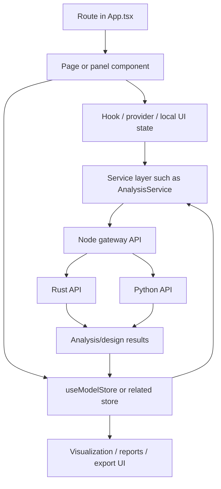

# BeamLab Frontend Route and Feature Map

This appendix maps the frontend route space to feature domains, architectural modules, and backend dependencies.

Primary source files:

- [`../apps/web/src/App.tsx`](../apps/web/src/App.tsx)
- [`../apps/web/src/config/appRouteMeta.ts`](../apps/web/src/config/appRouteMeta.ts)

## 1. Frontend route architecture summary

The frontend uses a route-first architecture with these core ideas:

- `App.tsx` is the central route registry
- most large pages are lazy-loaded with `React.lazy`
- protected routes are wrapped in `RequireAuth`
- authenticated pages are usually wrapped in `AppShell` through `ConditionalLayout`
- public pages bypass the app shell
- full-screen routes like `/app` and `/workspace/*` intentionally bypass the standard shell layout
- route metadata, breadcrumbs, and feature categorization live in `appRouteMeta.ts`

## 2. Layout and bootstrapping flow

### Boot-level cross-cutting hooks in `App.tsx`

| Concern | Mechanism |
|---|---|
| user registration sync | `useUserRegistration()` |
| device/session lifecycle | `useDeviceSession()` |
| global runtime error capture | `useGlobalErrorHandler()` |
| state/system integration | `initializeIntegration()` |
| auth-aware shell decision | `ConditionalLayout` + `useAuth()` |
| analytics | `AnalyticsProvider` |
| error containment | `ErrorBoundary`, `SectionErrorBoundary` |
| UX helpers | `OfflineBanner`, `ScrollToTop`, `CookieConsent`, `BackToTopButton` |

## 2.1 Exact frontend architecture anchors

| Concern | Verified file | Why it matters |
|---|---|---|
| auth state bridge | [`../apps/web/src/providers/AuthProvider.tsx`](../apps/web/src/providers/AuthProvider.tsx) | Unified Clerk-backed auth context, token retrieval, read-only fallback, sign-out cleanup |
| core modeling state | [`../apps/web/src/store/model.ts`](../apps/web/src/store/model.ts) | Central state for geometry, loads, combinations, results, clipboard, modal state, selection, persistence |
| analysis orchestration | [`../apps/web/src/services/AnalysisService.ts`](../apps/web/src/services/AnalysisService.ts) | Local-vs-cloud solver routing, validation, async polling, worker pool orchestration |
| pricing catalog | [`../apps/web/src/config/pricing.ts`](../apps/web/src/config/pricing.ts) | Plan IDs, checkout IDs, feature bundles, INR labels |
| payment handoff UI | [`../apps/web/src/components/PaymentGatewaySelector.tsx`](../apps/web/src/components/PaymentGatewaySelector.tsx) | Gateway selection and handoff into Razorpay/PhonePe payment flows |
| professional report UI | [`../apps/web/src/pages/ProfessionalReportGenerator.tsx`](../apps/web/src/pages/ProfessionalReportGenerator.tsx) | Section-based report composition and export UX |
| reusable report builder primitives | [`../apps/web/src/modules/reports/EngineeringReportGenerator.ts`](../apps/web/src/modules/reports/EngineeringReportGenerator.ts) | Structured report builder used to represent engineering outputs |

## 3. Public routes

| Route(s) | Main page/component | Feature chapter | Backend dependency |
|---|---|---|---|
| `/` | `LandingPage` | marketing/home | optional public landing APIs |
| `/pricing` | `EnhancedPricingPage` | pricing/subscriptions | billing/subscription backend via Node |
| `/sign-in/*` | `SignInPage` | auth | Node auth + Clerk/in-house auth mode |
| `/sign-up/*` | `SignUpPage` | auth | Node auth + Clerk/in-house auth mode |
| `/forgot-password` | `ForgotPasswordPage` | auth recovery | auth service |
| `/reset-password` | `ResetPasswordPage` | auth recovery | auth service |
| `/privacy-policy`, `/terms-*`, `/refund-cancellation` | legal pages | legal/compliance | none or public content APIs |
| `/help`, `/about`, `/contact`, `/capabilities` | support/marketing pages | help & public docs | none or public APIs |
| `/account-locked`, `/link-expired`, `/verify-email`, `/auth/callback/:provider` | auth state pages | auth lifecycle | auth/session backend |
| `/learning`, `/sitemap` | learning/navigation | support/discoverability | optional content sources |
| `/ui-showcase`, `/error-report`, `/rust-wasm-demo`, `/nafems-benchmarks`, `/worker-test` | diagnostics/demo pages | platform/demo/testing | mixed, often internal |

## 4. Authenticated workspace and account routes

| Route(s) | Main page/component | Frontend chapter | Likely backend family |
|---|---|---|---|
| `/stream` | `UnifiedDashboard` | dashboard/projects | `/api/project`, `/api/user`, `/api/usage` |
| `/settings` | `SettingsPage` | account/settings | `/api/user`, `/api/session` |
| `/notifications` | `NotificationsPage` | user comms | user/session/usage/notification-adjacent APIs |
| `/profile` | `ProfilePage` | user profile | `/api/user` |
| `/app` | `ModernModeler` | full-screen modeling workspace | analysis/design/project/session APIs |
| `/workspace/:moduleType` | `WorkspacePageWrapper` → `ModernModeler` | module workspace alias | same as `/app` |
| `/demo` | `ModernModeler` or pricing redirect | demo / gated trial | pricing + workspace dependencies |

## 5. Analysis routes

These routes represent the analysis chapter of the product.

| Route | Main component/page | Purpose | Likely backend owner |
|---|---|---|---|
| `/analysis/modal` | `ModalAnalysisRouteWrapper` / `ModalAnalysisPanel` | modal analysis | Rust primary |
| `/analysis/time-history` | `TimeHistoryPanel` | time-history analysis | Rust and/or Python |
| `/analysis/seismic` | `SeismicAnalysisPanel` | seismic analysis | Rust primary |
| `/analysis/buckling` | `BucklingAnalysisPanel` | buckling analysis | Rust primary |
| `/analysis/cable` | `CableAnalysisPanel` | cable analysis | Rust primary |
| `/analysis/pdelta` | `PDeltaAnalysisPanel` | p-delta analysis | Rust primary |
| `/analysis/nonlinear` | `NonlinearAnalysisPage` | nonlinear analysis | Rust with possible Python overlap |
| `/analysis/dynamic` | `DynamicAnalysisPage` | dynamic analysis | Rust/Python overlap |
| `/analysis/pushover` | `PushoverAnalysisPage` | nonlinear static analysis | Rust/Python overlap |
| `/analysis/plate-shell` | `PlateShellAnalysisPage` | FEM plate/shell analysis | Python and/or Rust solver extensions |
| `/analysis/sensitivity-optimization` | `SensitivityOptimizationDashboard` | parametric study/optimization | Rust optimization + supporting services |

Typical frontend dependencies:

- modeling state from `store/`
- analysis orchestration from `services/`
- API helpers from `lib/` or `api/`
- shell/full-screen route handling from `App.tsx`

### Exact analysis integration chain

```text
Analysis route in App.tsx
→ analysis page or panel component
→ useModelStore in store/model.ts
→ AnalysisService.ts
→ /api/analyze or /api/advanced through Node gateway
→ Rust API primary compute path
→ results persisted back into analysisResults and visualization/report flows
```

## 6. Design routes

| Route | Main component/page | Design chapter | Likely backend owner |
|---|---|---|---|
| `/design/steel` | `SteelDesignPage` | steel design | Rust primary |
| `/design/connections` | `ConnectionDesignPage` | connection design | Rust primary |
| `/design/reinforcement` | `ReinforcementDesignPage` | reinforcement utilities | Rust/Python overlap |
| `/design/detailing` | `DetailingDesignPage` | detailing | Rust/Python overlap |
| `/design/concrete` | `ConcreteDesignPage` | RC design | Rust primary, Python overlap |
| `/design/foundation` | `FoundationDesignPage` | foundation design | Rust/Python overlap |
| `/design/composite` | `CompositeDesignPage` | composite design | Rust primary |
| `/design/timber` | `TimberDesignPage` | timber design | Rust primary |
| `/design-center` | `StructuralDesignCenter` | unified design hub | aggregated design services |
| `/design-hub` | `PostAnalysisDesignHub` | post-analysis design workflow | analysis + design orchestration |

Typical backend path families involved:

- `/api/design`
- `/api/advanced` for some derived/advanced checks
- section/optimization endpoints where section selection is involved

## 7. Tools and utilities routes

| Route | Main page | Feature chapter | Likely backend owner |
|---|---|---|---|
| `/tools/load-combinations` | `LoadCombinationPage` | load utility | Rust/Python overlap |
| `/tools/section-database` | `SectionDatabasePage` | section browser | Rust and Python overlap |
| `/tools/bar-bending` | `BarBendingSchedulePage` | detailing utility | frontend + report/export helpers |
| `/tools/advanced-meshing` | `AdvancedMeshingDashboard` | meshing | Python primary |
| `/tools/print-export` | `PrintExportCenter` | export center | Node + report services |
| `/space-planning` | `SpacePlanningPage` | planning/layout | Python primary |
| `/room-planner` | `RoomPlannerPage` | room planning | Python/AI/layout services |

## 8. Reports and visualization routes

| Route | Main page | Frontend chapter | Likely backend owner |
|---|---|---|---|
| `/reports` | `ReportsPage` | report management | Node + report services |
| `/reports/builder` | `ReportBuilderPage` | custom report builder | frontend config + report services |
| `/reports/professional` | `ProfessionalReportGenerator` | professional documents | Python and/or Rust reports |
| `/visualization` | `VisualizationHubPage` | visualization hub | frontend-heavy |
| `/visualization/3d-engine` | `Visualization3DEngine` | 3D results viewer | frontend-heavy with analysis results |
| `/visualization/result-animation` | `ResultAnimationViewer` | animation playback | frontend-heavy with analysis results |

### Exact reporting integration chain

```text
Reports route in App.tsx
→ ReportsPage / ReportBuilderPage / ProfessionalReportGenerator
→ EngineeringReportGenerator.ts or page-local report composition
→ backend report APIs and/or local HTML export flow
→ user preview, download, print, or share action
```

## 9. Enterprise and integration routes

| Route | Main page | Feature chapter | Likely backend owner |
|---|---|---|---|
| `/collaboration` | `CollaborationHub` | team collaboration | Node sockets + project/user APIs |
| `/bim` | `BIMIntegrationPage` | BIM integration | Node interop + backend converters |
| `/bim/export-enhanced` | `BIMExportEnhanced` | export | Node interop |
| `/cad/integration` | `CADIntegrationHub` | CAD integration | Node interop + Python utilities |
| `/integrations/api-dashboard` | `APIIntegrationDashboard` | external API integrations | Node |
| `/materials/database` | `MaterialsDatabasePage` | materials data | mixed backend data sources |
| `/compliance/checker` | `CodeComplianceChecker` | compliance validation | Rust design + Node orchestration |
| `/cloud-storage` | `CloudStorageDashboard` | cloud file/data UX | Node/project/storage services |
| `/digital-twin` | `DigitalTwinDashboard` | enterprise/digital twin | mixed/integration-heavy |

## 10. Civil, AI, and learning routes

| Route | Main page | Chapter | Likely backend owner |
|---|---|---|---|
| `/civil/hydraulics` | `HydraulicsDesigner` | civil module | mixed/domain-specific services |
| `/civil/transportation` | `TransportationDesigner` | civil module | mixed/domain-specific services |
| `/civil/construction` | `ConstructionManager` | civil module | mixed/domain-specific services |
| `/quantity` | `QuantitySurveyPage` | civil utility | report/data services |
| `/ai-dashboard` | `AIPowerDashboard` | AI feature UI | Node + Python AI |
| `/ai-power` | `PowerAIPanel` | AI feature UI | Node + Python AI |
| `/learning` | `LearningCenter` | docs/training | mostly frontend/content |

## 10.1 Payment and subscription integration chain

```text
/pricing route
→ EnhancedPricingPage.tsx
→ config/pricing.ts plan metadata
→ PaymentGatewaySelector.tsx
→ RazorpayPayment.tsx or PhonePePayment.tsx
→ Node billing routes
→ subscription status persisted in backend user/subscription models
```

## 10.2 Frontend request flow diagram



## 11. Route metadata and discoverability

`appRouteMeta.ts` groups the frontend into these categories:

- workspace
- analysis
- design
- tools
- enterprise
- reports
- civil
- ai
- learning

This metadata layer is just as important as the route table, because it drives:

- navigation hierarchy
- labels and descriptions
- breadcrumbs
- search items
- default discovery flows for users

## 12. Frontend architectural dependencies by concern

| Concern | Main frontend area | Backing service concern |
|---|---|---|
| auth and route gating | `providers/`, `components/layout/RequireAuth`, `App.tsx` | Node auth + Clerk/JWT |
| dashboard/project UX | pages + store + services | Node project/user/session APIs |
| structural modeling | `ModernModeler`, workspace routes, store/core integration | Node projects + Rust/Python analysis |
| analysis panels | analysis pages/components | Rust primary, Python overlap |
| design pages | design pages/components | Rust primary, Python overlap |
| reporting UX | report pages/modules | Python/Rust reporting + Node orchestration |
| pricing/subscription UX | pricing page/config/hooks | Node billing/subscription state |
| AI experiences | AI pages/components/hooks | Node ingress + Python AI |
| collaboration | enterprise pages and shared state | Node socket server |

## 13. Reading guidance

- Need folder-level structure? Go to [`REPO_ARCHITECTURE_INVENTORY.md`](./REPO_ARCHITECTURE_INVENTORY.md)
- Need service ownership? Go to [`SERVICE_ROUTING_MATRIX.md`](./SERVICE_ROUTING_MATRIX.md)
- Need endpoint families? Go to [`API_SURFACE_MAP.md`](./API_SURFACE_MAP.md)
