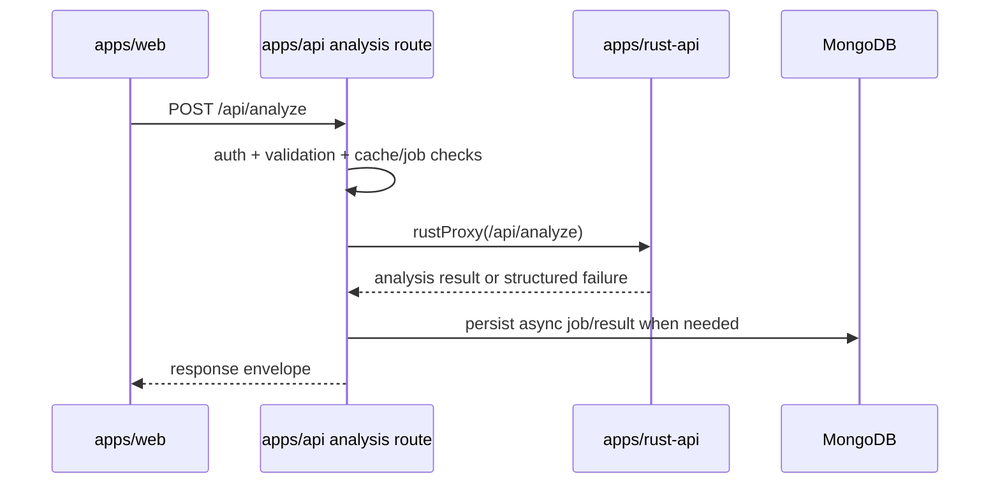
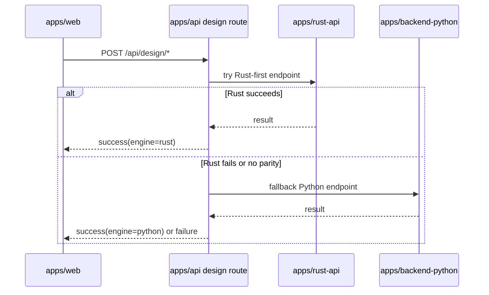

# BeamLab Service Routing Matrix

This appendix maps major feature areas and route families to the runtime most likely to own them based on the current codebase.

## Ownership legend

- **Frontend** — user-facing page or UI flow in `apps/web`
- **Gateway** — Node/Express ingress and policy layer in `apps/api`
- **Primary runtime** — service that appears to do the main work
- **Secondary / overlap** — service that also exposes related behavior or may serve as fallback/adjacent owner

## 1. Runtime summary

| Runtime | Primary role | Key entry file |
|---|---|---|
| Web frontend | User interface, route handling, local UX orchestration | [`../apps/web/src/App.tsx`](../apps/web/src/App.tsx) |
| Node gateway | Auth, security, CRUD, billing, analytics, proxy/orchestration | [`../apps/api/src/index.ts`](../apps/api/src/index.ts) |
| Rust API | High-performance compute, design codes, optimization, some reporting | [`../apps/rust-api/src/main.rs`](../apps/rust-api/src/main.rs) |
| Python API | AI, reports, layout, meshing, additional analysis/design/sections/jobs routes | [`../apps/backend-python/main.py`](../apps/backend-python/main.py) |
| Desktop shell | Packaging the web app via Tauri | [`../apps/desktop/tauri.conf.json`](../apps/desktop/tauri.conf.json) |

## 2. Feature-to-service routing

| Feature area | Frontend entry | Gateway route family | Primary runtime | Secondary / overlap | Notes |
|---|---|---|---|---|---|
| Public landing/legal/help | public pages in `apps/web/src/pages` | optional `/api/public` | Node | — | Mostly frontend-rendered with optional public data APIs |
| Auth/sign-in/sign-up | `/sign-in`, `/sign-up` | `/api/auth`, auth middleware | Node | Clerk external service | Gateway decides Clerk vs in-house JWT mode |
| User profile/session/usage | dashboard/profile/settings | `/api/user`, `/api/session`, `/api/usage` | Node | — | Session lifecycle also initialized from frontend hooks |
| Projects / CRUD | dashboard, workspace | `/api/project` | Node | MongoDB | Canonical project ownership appears to be Node |
| Analytics / event intake | global providers | `/api/analytics` | Node | — | Frontend analytics provider posts here |
| Consent / audit | legal/compliance flows | `/api/consent`, `/api/audit` | Node | — | Governance/business records |
| Billing / subscriptions | `/pricing` and subscription UX | `/api/billing`, `/api/billing/razorpay` | Node | payment providers | Public pricing UI, backend-owned subscription state |
| AI session persistence | AI dashboards/hooks | `/api/ai-sessions` | Node | Python AI logic | Node stores session-like artifacts, Python appears to generate AI outputs |
| AI feature execution | `/ai-dashboard`, `/ai-power` | `/api/ai` | Python | Node gateway | Node mediates, Python likely executes |
| Standard analysis | `/analysis/*`, `/app` | `/api/analyze`, `/api/analysis` | Rust | Python | Rust is the stronger fast-path owner; Python also exposes analysis routers |
| Advanced analysis | `/analysis/pdelta`, `/analysis/modal`, etc. | `/api/advanced` | Rust | Python | Rust exposes broad advanced analysis handlers |
| Design checks | `/design/*`, design center | `/api/design` | Rust | Python | Both runtimes expose design-related behavior |
| Sections database | section tools/pages | via gateway design/interop or direct service-specific APIs | Rust | Python | Both runtimes expose section routes; authority should be clarified |
| Templates | modeling and starter flows | `/api/templates` | Rust | Node gateway | Rust publicly serves templates |
| Jobs / long-running tasks | analysis/report async UX | `/api/jobs` | Node gateway + Python routers | Rust overlap | Ownership depends on specific workload |
| Reports / export generation | `/reports`, `/reports/builder`, `/reports/professional` | gateway route(s) and/or direct service families | Python | Rust | Both runtimes expose report-related capabilities |
| Layout / room planning | `/space-planning`, `/room-planner` | likely AI/layout route families | Python | Node gateway | Python has layout routers and layout_v2 |
| Meshing | advanced tools/pages | Python internal routers | Python | Rust overlap for solver consumption | Python clearly exposes meshing routes |
| Collaboration / project presence | `/collaboration`, project users | project user endpoint + sockets | Node | Python websocket routes | Node owns `SocketServer`; Python also has `ws_routes` |
| Structures storage / solver-owned models | modeling, analysis results | direct Rust structure endpoints | Rust | Node project persistence | Rust has structure CRUD endpoints |
| Desktop delivery | desktop app | none | Desktop/Tauri | web frontend | Desktop reuses the web build |

## 3. Route family detail by runtime

### Node gateway route families

Observed in [`../apps/api/src/index.ts`](../apps/api/src/index.ts):

- `/api/auth`
- `/api/user`
- `/api/session`
- `/api/usage`
- `/api/project`
- `/api/consent`
- `/api/audit`
- `/api/analytics`
- `/api/ai-sessions`
- `/api/feedback`
- `/api/billing`
- `/api/billing/razorpay`
- `/api/analyze`
- `/api/analysis`
- `/api/design`
- `/api/advanced`
- `/api/interop`
- `/api/templates`
- `/api/jobs`
- `/api/ai`

### Verified gateway ownership rules from route files

The gateway route implementations are more precise than high-level service comments. Verified file-level rules:

| Gateway file | Observed rule |
|---|---|
| [`../apps/api/src/routes/analysis/index.ts`](../apps/api/src/routes/analysis/index.ts) | Rust is the canonical analysis owner; Node is a thin authenticated proxy with cache/job/error handling |
| [`../apps/api/src/routes/design/index.ts`](../apps/api/src/routes/design/index.ts) | Design requests are Rust-first, with Python fallback for compatibility or missing parity |
| [`../apps/api/src/services/serviceProxy.ts`](../apps/api/src/services/serviceProxy.ts) | Node centrally manages timeout, retry, circuit-breaker, and backend health behavior |

This means the practical ownership contract is:

- **analysis:** Rust primary
- **design:** Rust primary, Python fallback
- **AI/layout/report-heavy workflows:** Python-oriented, usually through Node ingress
- **auth/billing/projects/policy:** Node primary

### Rust route families

Observed in [`../apps/rust-api/src/main.rs`](../apps/rust-api/src/main.rs):

- public: `/`, `/health`, `/api/openapi.yaml`, `/api/sections*`, `/api/templates/*`, `/api/metrics*`
- protected analysis: `/api/analyze*`, `/api/analysis/*`
- protected advanced: `/api/advanced/*`
- protected design: `/api/design/*`
- protected reports: `/api/reports/*`
- protected structures: `/api/structures/*`
- protected optimization: `/api/optimization/*`

### Python route families

Observed in [`../apps/backend-python/main.py`](../apps/backend-python/main.py) and [`../apps/backend-python/routers`](../apps/backend-python/routers):

- `/docs`, `/redoc`, `/health*`
- `/analyze/*`
- `/design/*`
- `/pinn/*` when available
- websocket/collaboration routes via `ws_routes`
- `/db/*`
- internal routers for jobs, meshing, analysis, stress/dynamic, sections, reports, AI, load generation, IS code checks, layout, layout_v2

## 4. Practical routing guidance

Use this as the working interpretation when documenting or onboarding:

1. **If the user is logging in, managing projects, paying, or dealing with account/session data:** start in Node.
2. **If the user is running heavy structural analysis or code-based design checks:** start in Rust, unless the feature clearly belongs to a Python-specific route family.
3. **If the user is generating AI-driven outputs, layouts, or document/report-heavy results:** start in Python, mediated by Node when exposed to the frontend.
4. **If the user is on desktop:** assume the same web frontend, packaged by Tauri.

## 5. Sequence views

### Analysis request path

### Design request path

## 6. Areas needing explicit source-of-truth decisions

| Area | Why it is ambiguous |
|---|---|
| Analysis | Rust and Python both expose analysis-related behavior |
| Design checks | Rust and Python both expose design families |
| Reports | Rust and Python both expose report generation surfaces |
| Jobs | Node mounts jobs routes, Python also has jobs routers |
| Collaboration | Node owns socket server, Python also exposes websocket-style routes |
| Sections | Rust and Python both expose sections logic |

Recommended next step for future hardening: turn this appendix into a versioned ownership contract and keep it updated when route families move.
